contact info sharing web app
============================
ICS MS project proposal  
J. David Beutel  
2013-08-20

For my ICS 699 project, I would like to implement a contact information
sharing web application.  It will enable friends and family to collaborate
in maintaining their address books.  The biggest challenge is how to
manage the privacy of third-party information.

Background
----------

I normally don't use postal addresses, until I
send out a bunch of holiday cards.  Then the Post Office returns a few,
because the addressee has moved during the year, so I sometimes need to
contact friends or relatives to get the updated address.  Phone numbers
and email addresses also change occasionally.  With this app, one person
can automatically share an update with friends or family.

I have done several class projects leading up to this one:

* Spring 2009 ICS 667:  Agile Usage-Centered Design of a
Social Networking Contact Book
* Fall 2009 ICS 668:  Managing Privacy for Transitive Sharing on a
Social Networking Site (literature review)
* Spring 2010 ICS 664:  We'll Call You (partial UI prototype)

Tentative Schedule
------------------

* 2013 Sep - research publications and apps since 2009
* 2013 Oct - design for below issues
* 2013 Nov - update prototype to current Grails
* 2013 Nov - authentication via Facebook, Google, etc
* 2013 Nov - email/notifications
* 2014 Dec - history/edit/add info
* 2014 Jan - permissions/privacy
* 2014 Feb - duplicates/unify/link
* 2014 Feb - import/export/sync
* 2014 Mar - user testing
* 2014 Apr - revisions and retesting
* 2014 May - write report

Previous Work
-------------

Below are samples of the interaction scheme
from my project for Spring 2009 ICS 667:  Agile Usage-Centered Design of a
Social Networking Contact Book.

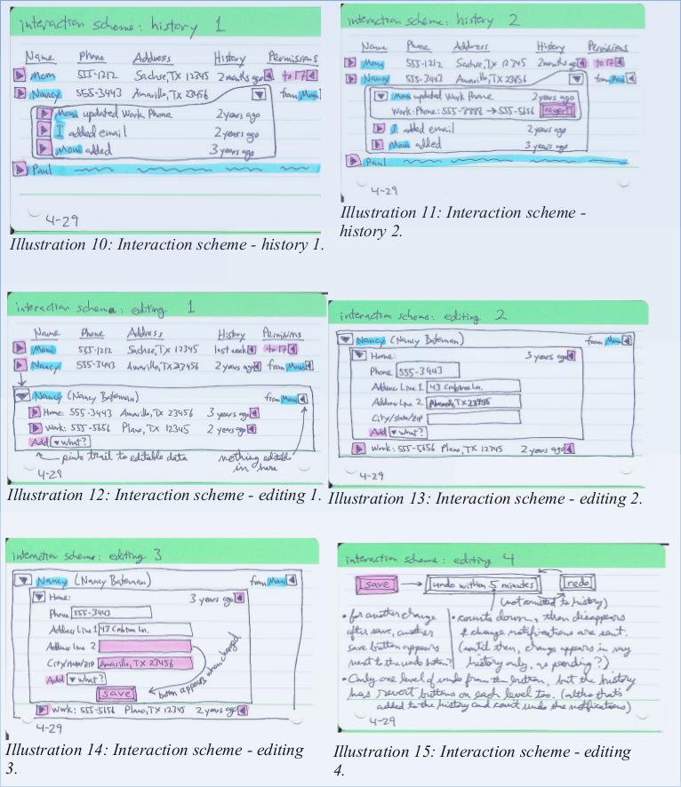

Below is a design from my project for
Spring 2010 ICS 664:  We'll Call You

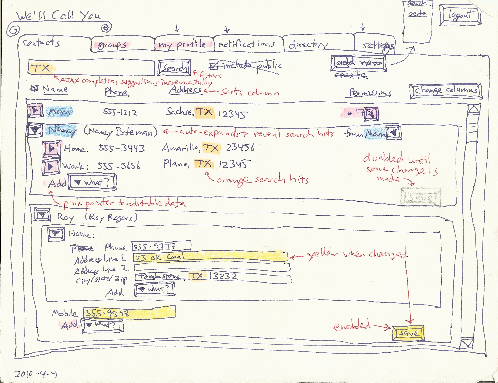

Below is a screen-shot from a partial UI prototype of the above project,
implemented as a Grails web application.
Due to time constraints, it does not actually implement editing or adding
contact information, permissions, history, search, notifications, etc.
I would like to do all that in this project.

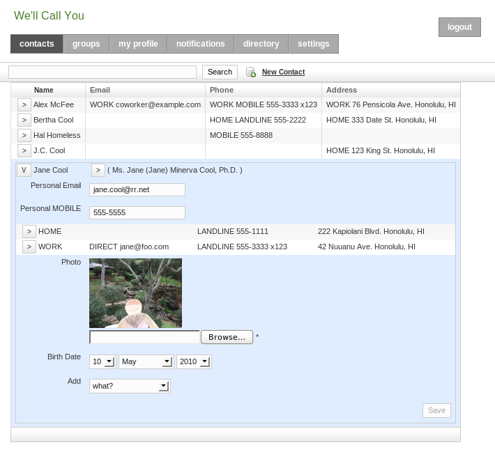

Issues
------

### privacy & trust ###

This kind of sharing raises privacy concerns.  A phone number or home
address connects to the physical world, so most people don't want
theirs to be public.  Deciding how to share ones own contact information with
a second party is straightforward; several apps already support this,
such as Google, Facebook, and Plaxo.  (See examples below.)
This limitation encourages the spread of these networks,
but it is unlikely to get all of ones contacts
to join the same network and manage their own contact information,
whether due to some choosing other networks, or to privacy concerns.

This forces one to manage other people's contact information
in ones own address book.  So, why not collaborate?
Well, sharing a third party's contact information with second parties
involves some wicked problems.

Suppose that my grandmother does not
use the app, so I input her address myself.  I know that she would
want my brother to have her new address, and I trust him to share it
appropriately, but how far does that trust go?  If he shares it with
his wife, can she share it with her friends?  If my grandmother finally
starts using the app, and asserts her privacy preferences, do they apply
to the information that other users have input about her?  Who owns
that information?  What cognitive model and UI would support this?
Would enough contextual integrity (Nissenbaum, 2004) be provided by
showing from whom the information or update came?

### unification ###

Different users will have different relations to the same contact.
If the app lacks good support for that, then it will not sustain the
collaboration that makes it worth-while.  In other words, for each user's
own privacy expectations on behalf of each contact, the app must allow
the user to easily share that contact with the other users who he trusts
to have it.

When a user imports his address book, some of his contacts will be in
different social groups.  They are all related to him, but not all to
each other.  If one of these contacts becomes a user, she must be able
to import her address book too, which will have only some overlap with
the first user's.  The app must recognize which contacts refer to the
same identity, for these two users to be able to share their updates
with each other.  A user may manually link or confirm an identity, to
accept updates.  On the other hand, the more hops separate two users,
the less information they will want to share about a contact.

At the logical extreme, suppose that a user, Bob, who I do not know,
also inputs my grandmother's address.  We cannot share this information,
because we have no reason to trust each other.  So, the app cannot have a
single copy of my grandmother's address that we all update, like a wiki.
It needs to have two separate contacts for this same identity.

Now, suppose that Charlie, who Bob and I both know, starts using the app,
and Bob and I both share my grandmother's address with him.  Charlie
doesn't want two copies in his address book.  So, each user needs his
own copy, receiving optional update advice that ripples through related
copies.  This could allow for a distributed, peer-to-peer architecture,
possibly utilizing attribute-based encryption,
as discussed by (Baden et al, 2009),
although my project will implement a centralized web app.  Each update
advice can come with some level of trust or certainty, based on the relation
it came from, and be applied automatically (with history to rollback if
necessary), or after confirmation of the notification,
similar to the system described by (Shand et al, 2003).
(Abdul-Rahman & Hailes, 2000) and (Jøsang, 2001)
provide a background for how that system handles subjective trust
and uncertainty.

My previous work designed permissions and history for the wiki model,
but the above issue leads me to think that this distributed model
would be better.

### identity ###

The app will need to identify contacts and users.

##### contacts #####

Contact identity, for unification, will be based on name 
and location.  Matches can be approximate or historical.
The user can confirm via linking.

##### users #####

The basis of a user's identity is their email address:
a ticket mailed in an invitation to that address links the new user
to the contact information containing that address.
Supporting authentication via Facebook, Google, etc. would allow
for a stronger identity.

Users input their own contact information, and can share it with a higher
level of trust than third parties can.  There is no absolute trust,
however, since impersonation is easy: a user can always assign a contact
an email address that he controls.  The app could at least warn about
suspicious identity, such as two users with the same name and location.

Existing Examples
-----------------

I have not yet found any existing system that supports what I would like
to implement with this project.  However, several current apps come close,
are well-implemented, and well-integrated.  None support collaborative
maintenance of third-party contact information, though.  I will do more
research to see if there are any designs or implementations that I can
utilize or mash-up for this project.

### Google ###

Various Google apps are well integrated,
and support some aspects of this project.

#### Google+ ####

A user's Profile in Google+ allows sharing of the user's own home and
work contact information, with a nice UI, especially for privacy settings.
The granularity with whom to share is good, integrating with "circles"
(i.e., groups), and allowing for individuals.  However, the granularity
of what to share is limited to all home or all work contact information.
For example, one cannot share ones home phone number with one group
and home address with a different group.  Also, Google+ does not
accept third-party contact information.

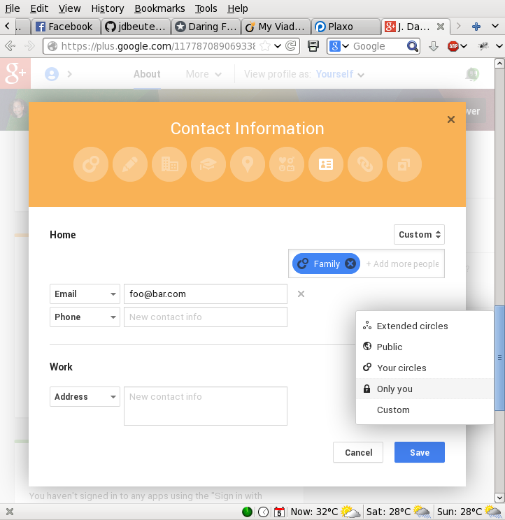

#### Gmail Contacts ####

The Contact Manager in Gmail, on the other hand, does allow third-party
contacts, in "My Contacts".  The user can input anyone.  However, it
does not support sharing that third-party data.  Second-party information
shared from the user's Google+ circles is also displayed, though.
Here is a circle named "Following".

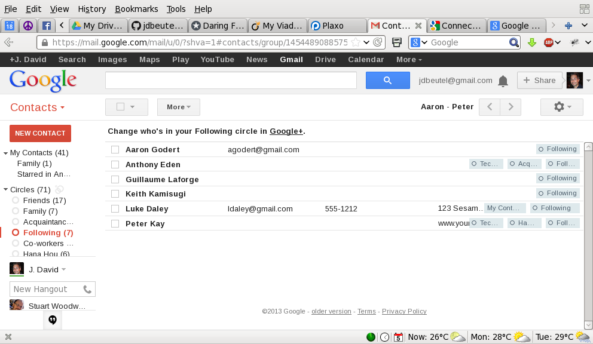

Any Google+ profile contact information that the second party shares
with the user, whether publicly, individually, or via the second party's
own circles, is displayed at the bottom.  The user can add more
information himself in the top part of the page, which adds the
contact to the "My Contacts" group, in addition to any circles.
Google does not support sharing any of that information with anyone else.
Although Google allows it to be exported, or synchronized with smart phones,
the assumption is that those are not for some other user.

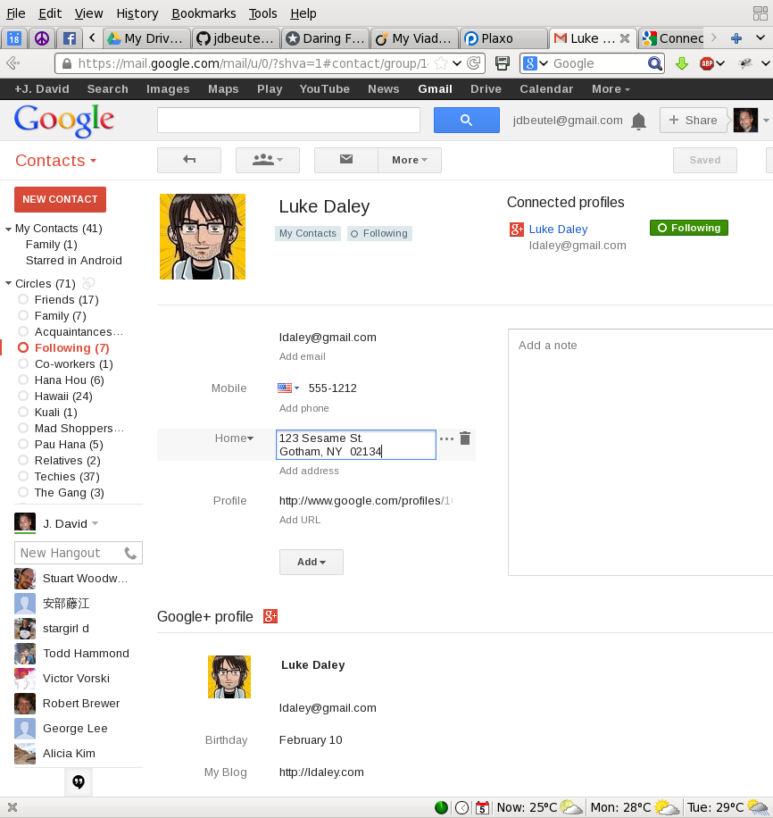

#### Android HTC ####

The "People" (a.k.a. Phonebook) on a smart-phone running Android 4.0
(HTC Sense 3.6) can be integrated with Contacts on Google and other
stacks, e.g., Facebook.  These contacts, which are sync'ed with separate
sources, can be linked on the phone.  Regarding the contact information
that the user inputs on his phone, he can choose to store it on-line in
his Google Contacts (instead of just on the phone).

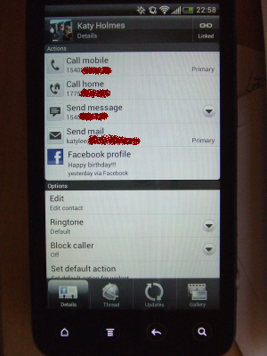
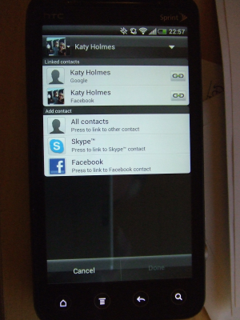

The phone stores links in the Notes field of the "My Contact" of
Google Contacts, e.g.,

    <HTCData><Facebook>id:575439899/friendof:1664495322</Facebook></HTCData>

#### Google Drive ####

Google Drive (nee Docs) supports sharing of third-party data,
or any data that can be put into a spreadsheet or other document.
The sharing is simple, at the top level, dividing documents
into ones the user owns, "My Drive", and ones shared with the user
by other owners, "Shared with me".

"My Drive" contains docs owned by me.

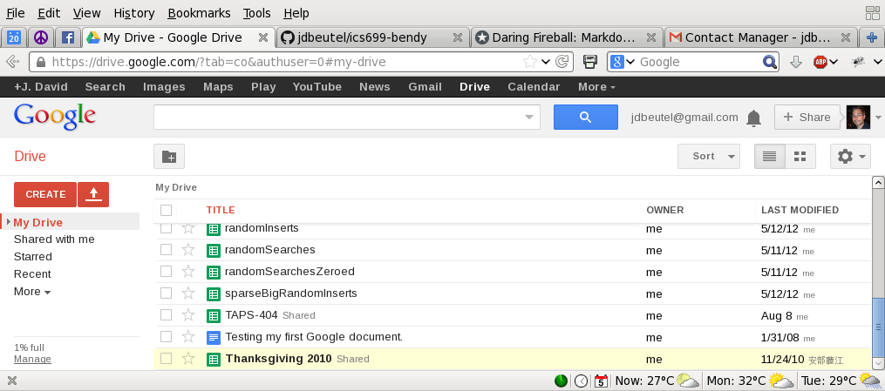

"Shared with me" contains docs owned by other users.

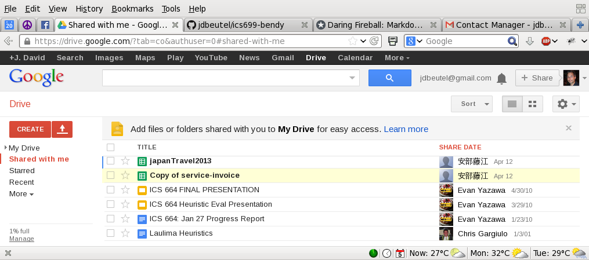

A document owner can choose to share it with other users.
However, this sharing is all or nothing; it cannot share only part of a doc.
So, it does not support the fine-grained sharing required by this project.

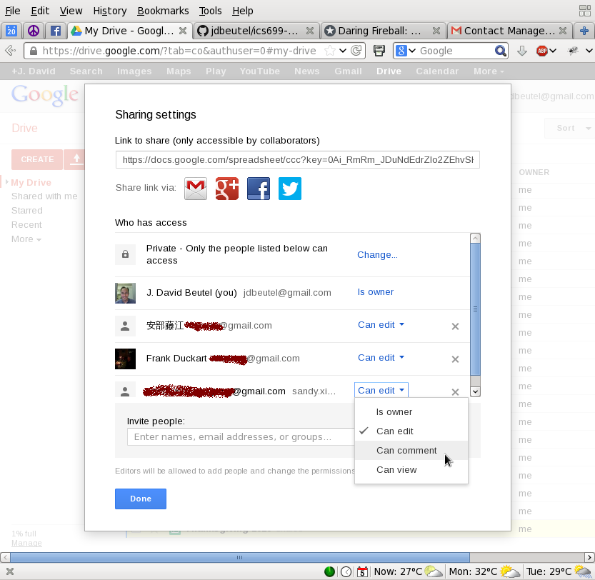

### Facebook ###

As with Google+, a Facebook user can add contact information to his profile
to share with second-parties, other Facebook users, or the public.
The choice of privacy settings are similar, with "lists" instead of "circles".

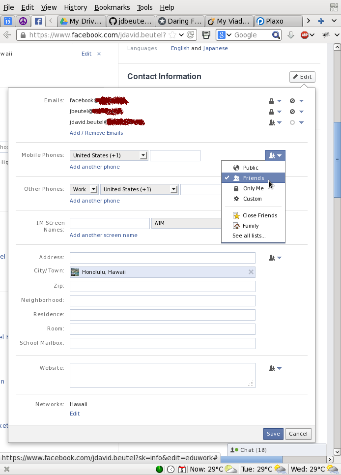

The user can customize access down to the individual,
or even excluding individuals from chosen groups.

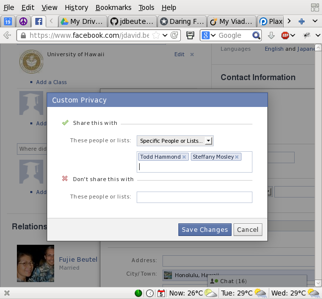

However, Facebook does not have a way to input or share third-party
contact information, although there could be Facebook apps that provide
this kind of functionality.  I will need to do some research to see
whether, once a user has shared his data with another Facebook user,
that second party can choose to share it with a third party, such
as a Facebook app.  Facebook at least allows this kind of sharing of
other kinds of information, such as tagging second or third parties in
photos and sharing them with other third parties.  On the other hand,
Facebook has some safeguards for this, such as notifying second parties
and allowing them to un-tag themselves or even un-friend the poster.

### Plaxo ###

Plaxo supports contact information similar to Google, but with
fewer privacy settings.  It encouraging users to share their own work
or home "cards" with second parties, and also allowing them to input,
import, or sync third parties.  But, it does not allowing them to share
third-party information.

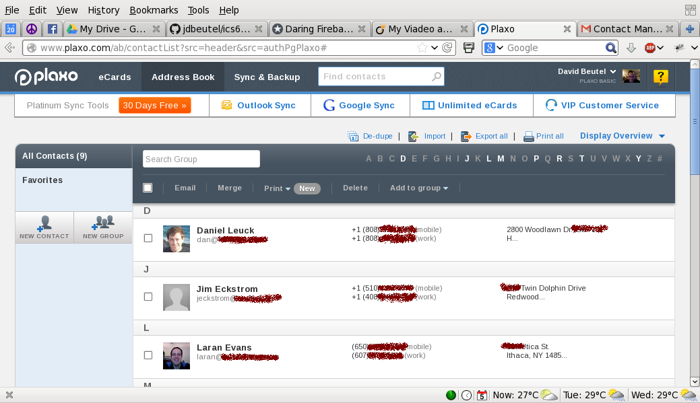

References
----------

Abdul-Rahman, A., & Hailes, S. (2000).
Supporting Trust in Virtual Communities.
In Hawaii International Conference on System Sciences 33, pp.1769-1777, 2000.

Baden, R., Bender, A., Spring, N., Bhattacharjee, B., & Starin, D. (2009).
Persona: an online social network with user-defined privacy.
SIGCOMM Comput. Commun. Rev., 39(4), 135-146. doi: 10.1145/1594977.1592585.

Jøsang, A. (2001).
A logic for uncertain probabilities.
International Journal of Uncertainty, Fuzziness
and Knowledge - Based Systems, 9(3):279-311, June 2001.

Nissenbaum, H. (2004).
Privacy as Contextual Integrity.
Washington Law Review 79 (2004), 101- 39.

Shand, B., Dimmock, N., & Bacon, J. (2003).
Trust for Ubiquitous, Transparent Collaboration.
First IEEE International Conference on Pervasive Computing and Communications.
