contact info sharing web app
============================
final report  
ICS 699 project  
J. David Beutel  
2014-10-20

Introduction
------------

I tried to implement a web application for sharing contact information,
to enable friends and family to collaborate in maintaining their address
books.  For years, I have wanted such an app for my own use, and I did
several projects building towards it.  The more preparatory work I did,
the more daunting it became, until I doubted whether I could complete an
implementation in just 6 credit-hours.  Nevertheless, I finally decided
that I had to try it anyway.

The biggest challenge that I anticipated was how to
manage the privacy of third-party information, in a way
that is easy to use.  Unfortunately,
I never got to that functionality, because I was dealing
with more fundamental issues first.
I started with a partial UI prototype that I made for
a project in Spring 2010 (ICS 664).
... etc, come back and summarize after adding the rest of the reports...

Background
----------

I normally don't use postal addresses, until I
send out a bunch of holiday cards.  Then the Post Office returns a few,
because the addressee has moved during the year, so I sometimes need to
contact friends or relatives to get the updated address.  Phone numbers
and email addresses also change occasionally.  With this app, one person
can automatically share an update with friends or family.

I have done several class projects leading up to this one:

* Spring 2009 ICS 667:  Agile Usage-Centered Design of a
Social Networking Contact Book
* Fall 2009 ICS 668:  Managing Privacy for Transitive Sharing on a
Social Networking Site (literature review)
* Spring 2010 ICS 664:  We'll Call You (partial UI prototype)

Tentative Schedule
------------------

* 2013 Oct - research publications and apps since 2009
* 2013 Nov - design for below issues
* 2013 Dec - update prototype to current Grails
* 2013 Dec - authentication via Facebook, Google, etc
* 2013 Dec - email/notifications
* 2014 Jan - history/edit/add info
* 2014 Feb - permissions/privacy
* 2014 Mar - duplicates/unify/link
* 2014 Mar - import/export/sync
* 2014 Apr - user testing
* 2014 May - revisions and retesting
* 2014 Jun - write report

Previous Work
-------------

Below are samples of the interaction scheme
from my project for Spring 2009 ICS 667:  Agile Usage-Centered Design of a
Social Networking Contact Book.

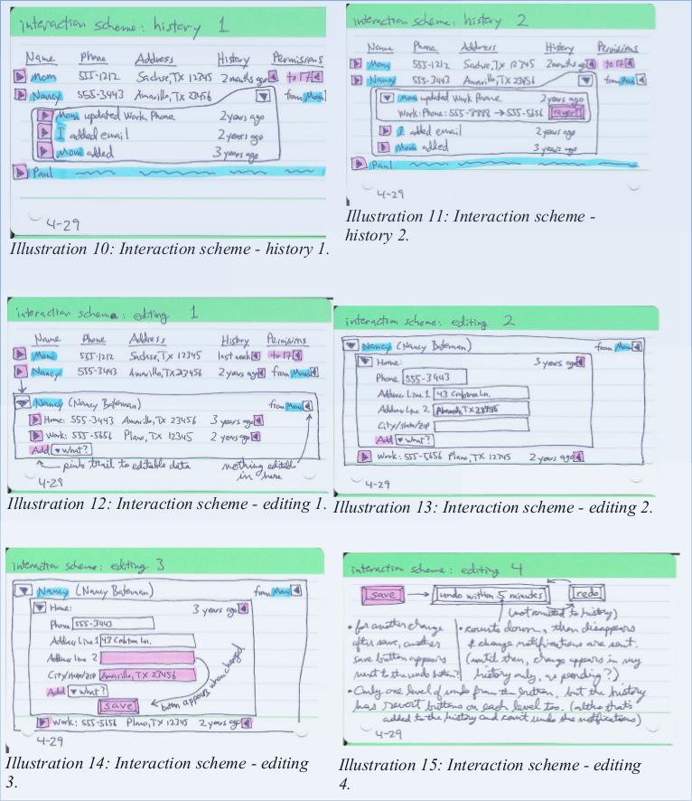

Below is a design from my project for
Spring 2010 ICS 664:  We'll Call You

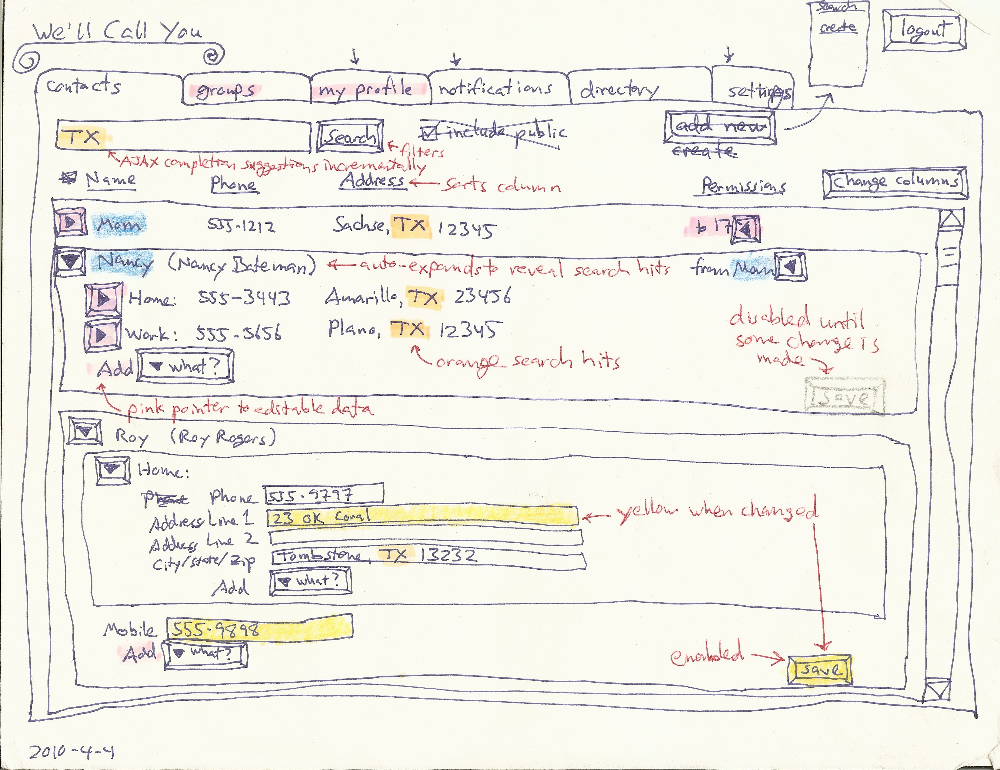

Below is a screen-shot from a partial UI prototype of the above project,
implemented as a Grails web application.
Due to time constraints, it does not actually implement editing or adding
contact information, permissions, history, search, notifications, etc.
I wanted to do all that in this project.

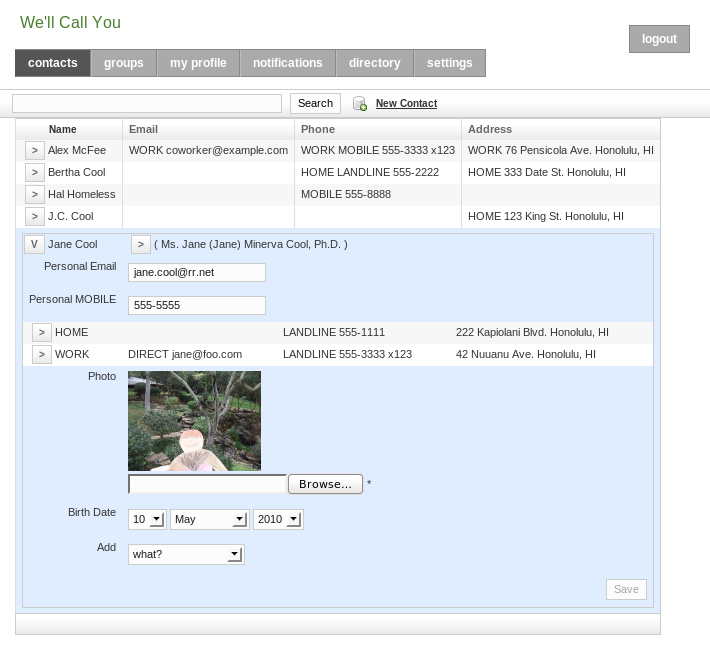

Issues
------

### privacy & trust ###

This kind of sharing raises privacy concerns.  A phone number or home
address connects to the physical world, so most people don't want
theirs to be public.  Deciding how to share ones own contact information with
a second party is straightforward; several apps already support this,
such as Google, Facebook, and Plaxo.  (See examples below.)
However, these networks do not support the sharing of third-party
information, so their users are encouraged to get their contacts
to join the same network.  While that helps to spread the network,
one cannot expect to get all of ones contacts
to join and manage their own contact information.
Some will choose to join other networks instead, or refrain entirely
due to privacy concerns.

This forces one to manage other people's contact information
in ones own address book.  So, why not collaborate?
The difficulty is that sharing a third party's contact information
with second parties involves some wicked problems.

Suppose that my grandmother does not
use the app, so I input her address myself.  I know that she would
want my brother to have her new address, and I trust him to share it
appropriately, but how far does that trust go?  If he shares it with
his wife, can she share it with her friends?  If my grandmother finally
starts using the app, and asserts her privacy preferences, do they apply
to the information that other users have input about her?  Who owns
that information?  What cognitive model and UI would support this?
Would enough contextual integrity (Nissenbaum, 2004) be provided by
showing from whom the information or update came?

### unification ###

Different users will have different relations to the same contact.
If the app lacks good support for that, then it will not sustain the
collaboration that makes it worth-while.  In other words, for each user's
own privacy expectations on behalf of each contact, the app must allow
the user to easily share that contact with the other users who he trusts
to have it.

When a user imports his address book, some of his contacts will be in
different social groups.  They are all related to him, but not all to
each other.  If one of these contacts becomes a user, she must be able
to import her address book too, which will have only some overlap with
the first user's.  The app must recognize which contacts refer to the
same identity, for these two users to be able to share their updates
with each other.  A user may manually link or confirm an identity, to
accept updates.  On the other hand, the more hops separate two users,
the less information they will want to share about a contact.

At the logical extreme, suppose that a user, Bob, who I do not know,
also inputs my grandmother's address.  We cannot share this information,
because we have no reason to trust each other.  So, the app cannot have a
single copy of my grandmother's address that we all update, like a wiki.
It needs to have two separate contacts for this same identity.

Now, suppose that Charlie, who Bob and I both know, starts using the app,
and Bob and I both share my grandmother's address with him.  Charlie
doesn't want two copies in his address book.  So, each user needs his
own copy, receiving optional update advice that ripples through related
copies.  This could allow for a distributed, peer-to-peer architecture,
possibly utilizing attribute-based encryption,
as discussed by (Baden et al, 2009),
although my project will implement a centralized web app.  Each update
advice can come with some level of trust or certainty, based on the relation
it came from, and be applied automatically (with history to rollback if
necessary), or after confirmation of the notification,
similar to the system described by (Shand et al, 2003).
(Abdul-Rahman & Hailes, 2000) and (Jøsang, 2001)
provide a background for how that system handles subjective trust
and uncertainty.

My previous work designed permissions and history for the wiki model,
but the above issue leads me to think that this distributed model
would be better (even in a centralized web app).

### identity ###

The app will need to identify contacts and users.

##### contacts #####

Contact identity, for unification, will be based on name 
and location.  Matches can be approximate or historical.
The user can confirm via linking.

##### users #####

The basis of a user's identity is their email address:
a ticket mailed in an invitation to that address links the new user
to the contact information containing that address.
Supporting authentication via Facebook, Google, etc. would allow
for a stronger identity.

Users input their own contact information, and can share it with a higher
level of trust than third parties can.  There is no absolute trust,
however, since impersonation is easy: a user can always assign a contact
an email address that he controls.  The app could at least warn about
suspicious identity, such as two users with the same name and location.

Existing Examples
-----------------

I have not yet found any existing system that supports what I would like
to implement with this project.  However, several current apps come close,
are well-implemented, and well-integrated.  None support collaborative
maintenance of third-party contact information, though.  I will do more
research to see if there are any designs or implementations that I can
utilize or mash-up for this project.

### Google ###

Various Google apps are well integrated,
and support some aspects of this project.

#### Google+ ####

A user's Profile in Google+ allows sharing of the user's own home and
work contact information, with a nice UI, especially for privacy settings.
The granularity with whom to share is good, integrating with "circles"
(i.e., groups), and allowing for individuals.  However, the granularity
of what to share is limited to all home or all work contact information.
For example, one cannot share ones home phone number with one group
and home address with a different group.  Also, Google+ does not
accept third-party contact information.

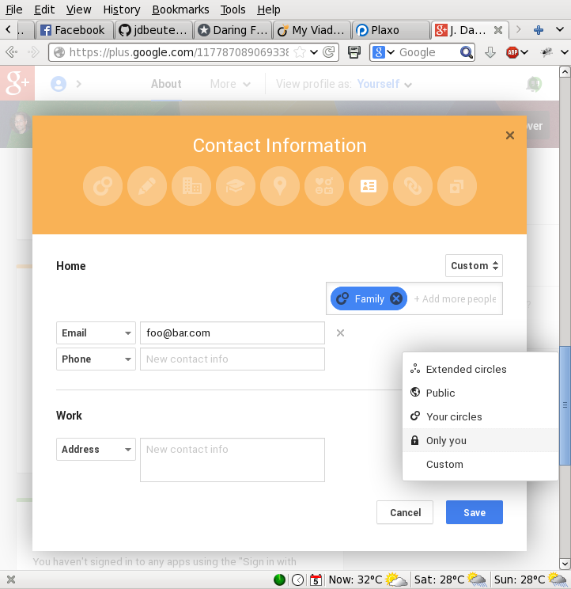

#### Gmail Contacts ####

The Contact Manager in Gmail, on the other hand, does allow third-party
contacts, in "My Contacts".  The user can input anyone.  However, it
does not support sharing that third-party data.  Second-party information
shared from the user's Google+ circles is also displayed, though.
Here is a circle named "Following".

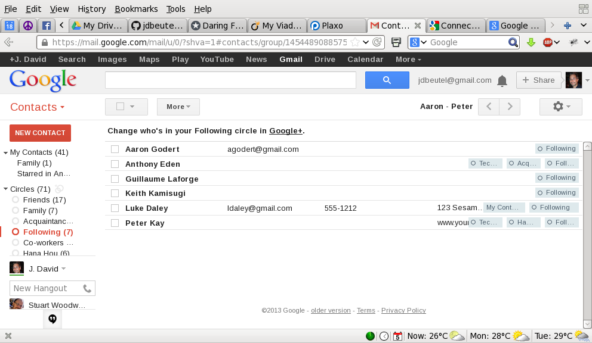

Any Google+ profile contact information that the second party shares
with the user, whether publicly, individually, or via the second party's
own circles, is displayed at the bottom.  The user can add more
information himself in the top part of the page, which adds the
contact to the "My Contacts" group, in addition to any circles.
Google does not support sharing any of that information with anyone else.
Although Google allows it to be exported, or synchronized with smart phones,
the assumption is that those are not for some other user.

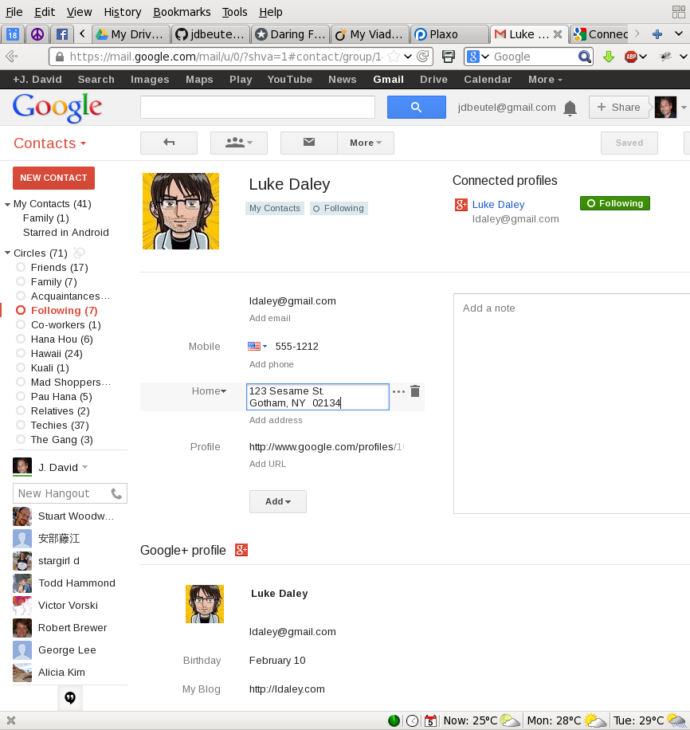

#### Android HTC ####

The "People" (a.k.a. Phonebook) on a smart-phone running Android 4.0
(HTC Sense 3.6) can be integrated with Contacts on Google and other
stacks, e.g., Facebook.  These contacts, which are sync'ed with separate
sources, can be linked on the phone.  Regarding the contact information
that the user inputs on his phone, he can choose to store it on-line in
his Google Contacts (instead of just on the phone).

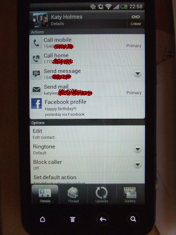
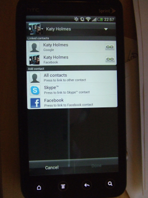

The phone stores links in the Notes field of the "My Contact" of
Google Contacts, e.g.,

    <HTCData><Facebook>id:575439899/friendof:1664495322</Facebook></HTCData>

#### Google Drive ####

Google Drive (nee Docs) supports sharing of third-party data,
or any data that can be put into a spreadsheet or other document.
The sharing is simple, at the top level, dividing documents
into ones the user owns, "My Drive", and ones shared with the user
by other owners, "Shared with me".

"My Drive" contains docs owned by me.

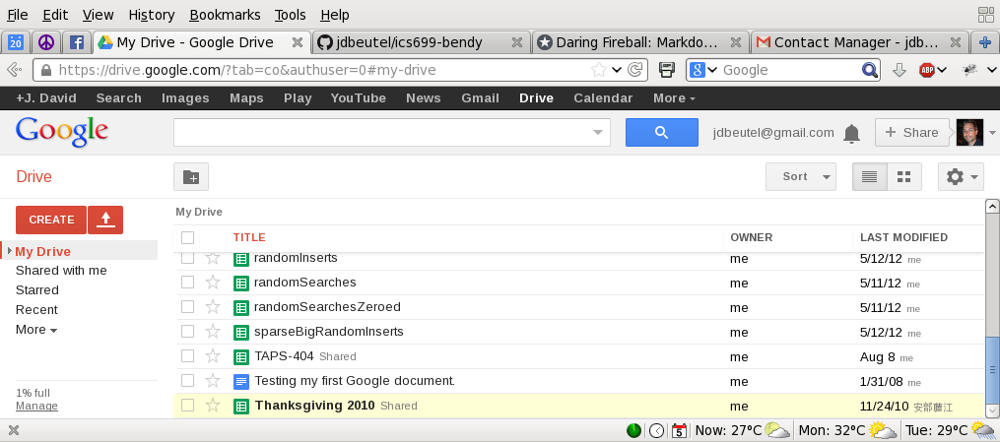

"Shared with me" contains docs owned by other users.

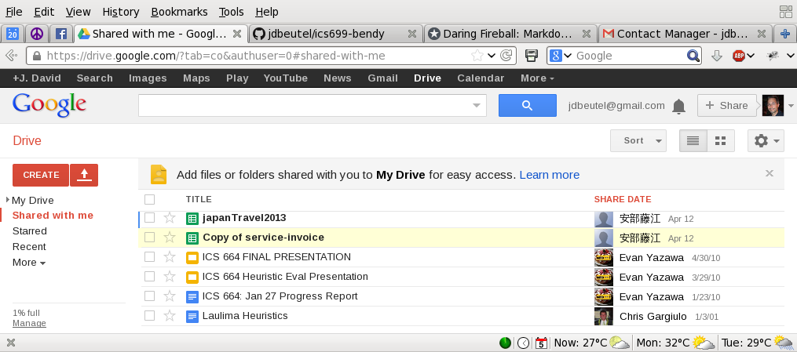

A document owner can choose to share it with other users.
However, this sharing is all or nothing; it cannot share only part of a doc.
So, it does not support the fine-grained sharing required by this project.

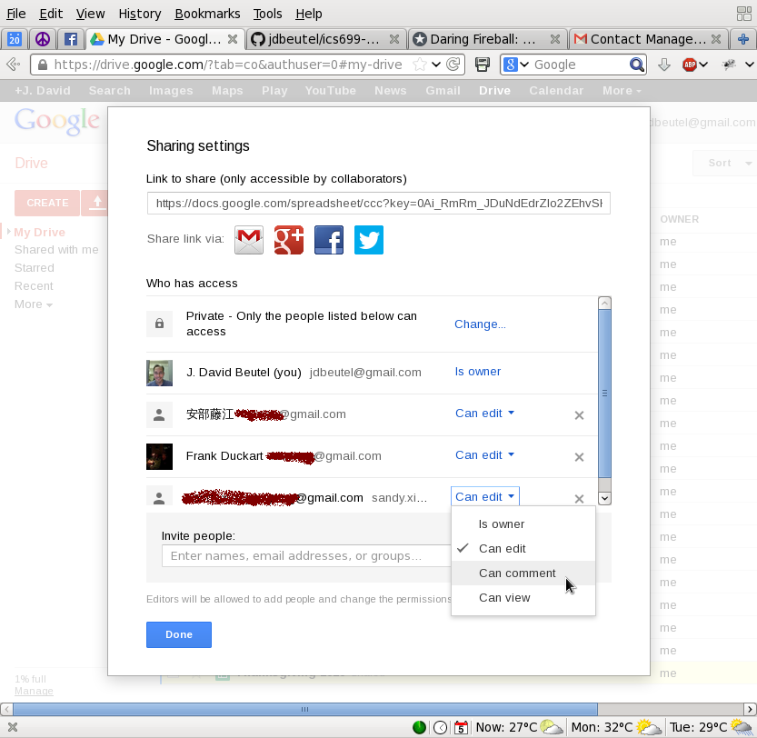

### Facebook ###

As with Google+, a Facebook user can add contact information to his profile
to share with second-parties, other Facebook users, or the public.
The choice of privacy settings are similar, with "lists" instead of "circles".

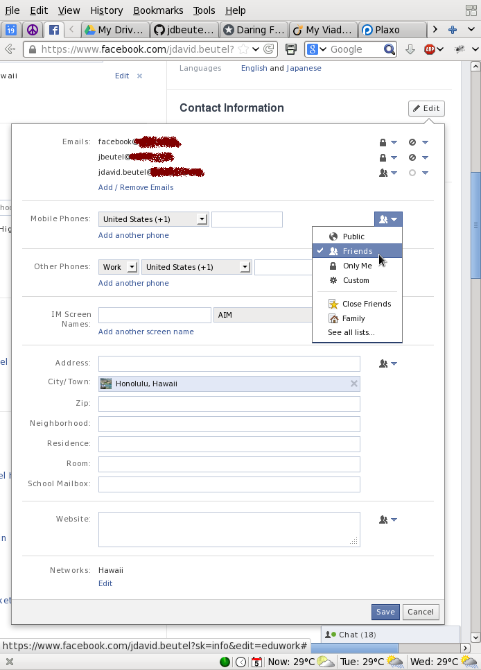

The user can customize access down to the individual,
or even excluding individuals from chosen groups.

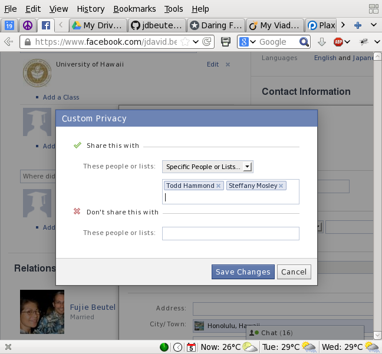

However, Facebook does not have a way to input or share third-party
contact information, although there could be Facebook apps that provide
this kind of functionality.  I will need to do some research to see
whether, once a user has shared his data with another Facebook user,
that second party can choose to share it with a third party, such
as a Facebook app.  Facebook at least allows this kind of sharing of
other kinds of information, such as tagging second or third parties in
photos and sharing them with other third parties.  On the other hand,
Facebook has some safeguards for this, such as notifying second parties
and allowing them to un-tag themselves or even un-friend the poster.

### Plaxo ###

Plaxo supports contact information similar to Google, but with
fewer privacy settings.  It encouraging users to share their own work
or home "cards" with second parties, and also allowing them to input,
import, or sync third parties.  But, it does not allowing them to share
third-party information.

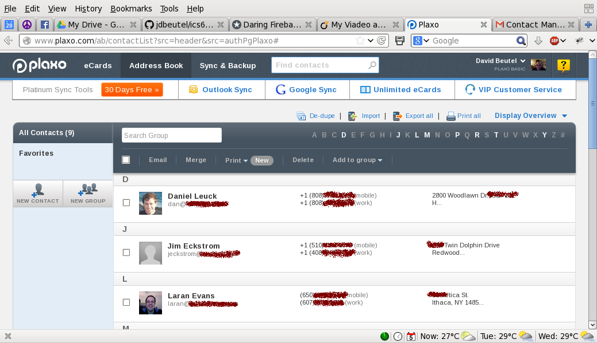

References
----------

Abdul-Rahman, A., & Hailes, S. (2000).
Supporting Trust in Virtual Communities.
In Hawaii International Conference on System Sciences 33, pp.1769-1777, 2000.

Baden, R., Bender, A., Spring, N., Bhattacharjee, B., & Starin, D. (2009).
Persona: an online social network with user-defined privacy.
SIGCOMM Comput. Commun. Rev., 39(4), 135-146. doi: 10.1145/1594977.1592585.

Jøsang, A. (2001).
A logic for uncertain probabilities.
International Journal of Uncertainty, Fuzziness
and Knowledge - Based Systems, 9(3):279-311, June 2001.

Nissenbaum, H. (2004).
Privacy as Contextual Integrity.
Washington Law Review 79 (2004), 101- 39.

Shand, B., Dimmock, N., & Bacon, J. (2003).
Trust for Ubiquitous, Transparent Collaboration.
First IEEE International Conference on Pervasive Computing and Communications.

contact info sharing web app
============================
ICS MS project status report  
J. David Beutel  
2013-12-10

Delay
-----

I started my ICS 699 project at the end of August, but was interrupted
September 6 when hit by a truck (breaking my thumb).  It required
surgery on September 16.  This took time to arrange and recover from,
so we postponed the schedule by a month.  June is my current target
to finish the project.

Research
--------

To update my literature review from 2009, I found [five
publications](../newResearch) since then that referenced the
same references, and looked interesting.  However, when I [read
them](../newResearch/notes.md), they did not provide answers to the design
issues of my current project.

The best use I can make of the new research, I think, is as examples of
what my final report might look like for this project.  One also supported
my decision to not use a decentralized architecture for the app.  I am
tempted by such an architecture, because it would mirror the data model,
but it would just complicate the project for no real benefit.

I could continue researching, but I had to go on with the project.
I doubt that I am overlooking any important research.

Design
------

I updated the design of my previous project to the distributed data model
that I suggested in my proposal.  It still seems better, so far.
My previous design was like Wikipedia, where users collaborate
to keep the same instance of data up to date.  My new design is more like
Github, when users fork their own copy of the data and share updates.
Forking is more complicated, but it matches better with what users do
in the real world with their own physical address books or smartphones.
Although the model is distributed, I will still be implementing it on
a centralized architecture.

### Data Model

The Wikipedia model was oriented around who can view or edit each
instance of data.  The UI included a color key on expansion toggle
buttons to indicate that zooming in will reveal editable data.
It also displayed the owner of the data, if other than the current user.
It was complicated by managing transitive access to the data,
such as friend-of-a-friend, potentially revoking access to the
user who provided the data in the first place.

In the Github model, the user can edit all the data she can see,
because she gets her own copy of it.  Just like the real world,
if the user has access to some data, then she can choose with whom
to share that data, directly.

When data is shared, each copy retains the ID of the original, along
with its own ID.  This forms a set across transitive copies of the data,
allowing the app to group together updates for the same original ID.
The user can share her updates with a subset, or whichever users she
chooses.  Updates offered to a shared group display which members have
accepted or rejected them.  If a user hijacks a shared contact, like a
hijacked email thread, by filling in the wrong data, or data for another
contact, then peer pressure comes into play.  The other users
can reject such updates, or contact the transgressor out-of-band.

Besides sets of copies, there may be duplicate data,
input by multiple users, or imported from multiple sources.
Like contacts on an HTC smartphone, the app can suggest duplicates,
and the user can link them by confirming.  The app updates the
linked data with each other, so the user can choose to let
missing data be filled in, or inconsistent data be unifed.
Data that are linked are displayed together.  Duplicate data
can provide different streams of updates from different sources,
and share updates with different groups.

### Privacy

The contacts in my previous model were discoverable, exposing
name and city to the public, like on Facebook, so users could
send access requests to the (hidden) owner of the single instance
of contact data.  On the other hand, the owner of the data
had full control over it, even if it came from other users,
which I expected to increase privacy, but raised issues of
fairness and expectations of the conceptual model.
In my new model, the contacts are not discoverable; each user
has her own contacts, and can choose to share them as she wishes.
The app supports offers, but not requests, to share data.
If users make requests, they will need to be out-of-band,
outside the app.

### Editing UI

Since the app will be used more to read than to write,
I am going with a more conventional mode for editing.
The data will not be in input fields until the user presses
the Edit button.  Then Edit becomes Save, a Cancel link is added,
and the collapse buttons are disabled, preventing the user from
hiding unsaved data.  Changed input fields and the Save button
will still be highlighted in yellow.  If possible, warn the
user about closing a tab or navigating off a page with unsaved data.

After Cancel, a Redo button appears.  Likewise, after Save,
an Undo button appears.  The undo period is limited to 10 minutes,
after which other users may receive update notifications,
and email may be sent.  After that timeout, the change can
still be undone via history, although other users may have already
accepted that change.

Implementation
--------------

I have just started updating my previous prototype to Grails 2.3.
For my current project, I am planning to make a single-page
AJAX app, using AngularJS and REST features in Grails 2.3.

Updated Schedule
------------------

* 2013 Oct - research publications and apps since 2009
* 2013 Nov - design for below issues
* 2013 Dec - update prototype to current Grails
* 2013 Dec - authentication via Facebook, Google, etc
* 2014 Jan - email/notifications
* 2014 Jan - history/edit/add info
* 2014 Feb - permissions/privacy
* 2014 Mar - duplicates/unify/link
* 2014 Mar - import/export/sync
* 2014 Apr - user testing
* 2014 May - revisions and retesting
* 2014 Jun - write report

contact info sharing web app
============================
ICS MS project status report 2014 January & February  
J. David Beutel  
2014-02-26

User Testing
------------

I did some user testing of the old prototype
while at my mother's on the mainland over the New Year's break.

### Format

* 4 users, from my immediate family, 1 male, 3 female, ages 50s, 60s, & 90s.
* I worked with each individually, for about an hour,
without each seeing any others doing this.
* I described the scenario to the user that she had received an email
from me, offering to share contact information for family and friends,
with a link to the page that I showed her in the browser of my Mac.
* The page was the login page of the prototype, with a link to register.
* I asked the users to explore the app, thinking out loud,
while I took notes.

### Results

* Most users tried to login before registering.  The login requests
an email address as an identifier, and for the password some tried
to use their email password, even though they had not registered
yet.  To mitigate this, my new app will send an email with a link
directly to the registration page, not the login page.  The
registration page will have an "I already signed up" link to the
login page.  The login page will still have a link to "sign up",
for users who arrive by URL or search engine.
* The registration form caused several problems.
The worst was that it required a profile image,
which users were unsure about how to select,
and any validation error required the image file to be selected again,
because the original selection was forgotten.
This will not be a problem with my new app, 
because it will not require any image for registration
(allowing essentially anonymous users, as the model is oriented
around the user, not an objective method for discovering other users).
* The password confirmation also caused some difficulties,
although that illustrated its necessity.  My new app will
ameliorate that by not obscuring the password input characters,
and providing ways to register and authenticate with existing
accounts and single sign-on (such as Google or Facebook).
* One user got stuck in the registration,
and I helped her complete it, but used the wrong name.
She was then able to navigate to her profile and correct her own name.
But, then she tried to navigate with the browser forwards and backwards buttons,
which failed to show the results of her editing and saving, confusing her.
I am not sure how to avoid this issue.
* Many users tried clicked in the middle of the contact lines
to get more details, before learning that they had to click
the [>] buttons on the left edge to expand the details.
(Some users had recently started
using Windows 8, with its flat design.)  To improve this,
my new app will expand for clicking anywhere on the line.
* The user in her 90s had very little computer experience.
For example, she was unsure how to use the Shift key to type the @ symbol
in her email address.  I moved the test to the browser on her own
computer, but she still could not explore the app on her own.
I am not going to constrain the design of my new app for such users.

Implementation
--------------

For user testing, I upgraded my previous prototype to Grails 1.3.9
and modified it to run in mainland timezones.
For my new app, I continued updating the prototype to Grails 2.3,
using [the same code repository](https://github.com/jdbeutel/ics699-bendy).
Several app components, such as authentication, are still using older options
for backwards compatibility.

I started a new app as a sandbox for using new authentication plugins,
based on Spring Security 2,
in [a new code repository](https://github.com/jdbeutel/ics699-ss2).
I added email confirmation for registration,
and registration and authentication by Google or Facebook account.
I still need to migrate this to my original app,
replacing its old authentication component.

I made both those Github repos private, like this ics699-docs repo,
to avoid worrying about leaking sensitive information during
project development.  However, I also externalized the
sensitive information, such as passwords and secret keys for
sending email and authenticating with Google and Facebook, to avoid committing
it to the repo, so I can eventually make the code repos public again.

I am planning to make a primarily single-page
AJAX app, using AngularJS and REST features in Grails 2.3.
I attended an AngularJS hackfest on Feb 13,
where I tried a small sample,
but I need to go through AngularJS tutorials in detail.

Updated Schedule
------------------

I am behind my tentative schedule, and need to update it.

I have done most of the December tasks,
updating the prototype to current Grails,
and authentication via Facebook & Google.
I have also made a little progress on some January and February tasks,
sending a confirmation email for registration,
and finding that the Spring Security Access Control List
plugin may help me implement permissions.

However, I did not get a lot done in February.
I was busy updating my work project to the current version
of Grails.  (This should help my MS project, too.)

I would like to extend my schedule by two months,
through August, and work on reimplementing the UI in AngularJS
next.  Redoing the UI now will allow me to implement
the additional features in the new UI, with less to redo later.

* 2013 Oct - research publications and apps since 2009
* 2013 Nov - design for below issues
* 2013 Dec - user testing on old prototype
* 2014 Jan - update prototype to current Grails
* 2014 Feb - authentication via Facebook, Google, etc
* 2014 Mar - redo UI with AngularJS
* 2014 Mar - email/notifications
* 2014 Apr - history/edit/add info
* 2014 Apr - permissions/privacy
* 2014 May - duplicates/unify/link
* 2014 May - import/export/sync
* 2014 Jun - user testing
* 2014 Jul - revisions and retesting
* 2014 Aug - write report

contact info sharing web app
============================
ICS MS project status report 2014 March  
J. David Beutel  
2014-04-03

Conversion to AngularJS
-----------------------

I spent a lot of time in March learning AngularJS and converting to it.
I have not finished yet, but I will continue, because I still think
that my project will be much better with Angular.

### Replacing Prototype

I completed the Angular tutorial and converted my project's old
JavaScript (based on the Prototype library) to Angular, starting
with the Settings page.  However, this update of the existing
JavaScript was superficial, because it had only the following
functionality:
* a button to expand and collapse the change password section
* highlighting modified input fields
* enabling and highlighting the save button for modifications

It still reloaded the whole page to display input validation error
messages, like a traditional web app, not the way that an Angular
web app is supposed to work.

### AJAX, JSON, & REST

Next I converted that page to the Angular style, using AJAX, and
on the server side, converted its Grails controller to REST and
JSON.  The server sends the static page, and the Angular controller
gets the data to fill in and initially display.  The save button
posts another AJAX request, without reloading the page.  A successful
response resets the modification highlighting and updates the model's
version numbers for optimistic locking, while an error response
just displays the error messages from the server.

An optimistic locking failure is a special case, displaying the
newer data from the server and an error message from the client.
I am thinking about eliminating this optimistic locking on the user
level, allowing the last post to win, because users will be editing
only their own copies of the data, but for this conversion I left
it in.

### Angular Form Validation

I also learned about the native Angular support for form modification
and validation, using that instead of my initial conversion.
However, I found that the modification support was not quite what I need, because 
after an input field is modified once, Angular still considers
it to be modified after it is changed back to its original value.
Modifications in my project are more significant, because they
generate notifications, so I don't want any false indicators.
I implemented another Angular directive to handle modifications
properly within the native Angular form support.  It was harder
to do, because it was tightly integrated with the Angular framework.

For form validation, I planned to use the new support in HTML5.
[User testing shows](http://alistapart.com/article/inline-validation-in-web-forms)
that this kind of immediate feedback is a better UI than the
traditional page reload.  The server still needs to do all the same
validation, to prevent hacking at least, but it need not render
nice, user-friendly error messages, since the browser will have
already done that and prevented the form submit.  Unfortunately,
I found some problems with HTML5 forms:
* browsers do not treat an AJAX request the same as a form submit
* Safari (including iPad/iPhone) provides no UI for this validation
* some of my validation, such as the matching password confirmation,
cannot be done with HTML5 form validation.

So, I will look for a good way to do this
[form validation UI](http://www.html5rocks.com/en/tutorials/forms/constraintvalidation/)
with Angular.  One possibility is
[this extension of Angular](https://github.com/nelsonomuto/angular-ui-form-validation).
Another possibility is
[the form support in Webshim](http://afarkas.github.io/webshim/demos/index.html#Forms),
which is based on the
[HTML5 constraint validation API](http://www.whatwg.org/specs/web-apps/current-work/#constraints).

### Additional Work

After finishing the form validation UI, the last issue for the Settings page
is converting all the pages to Angular templates, within a 
single-page app, using Angular's routing module.  Since the navigation is
no longer following links and reloading pages, the user can no longer discard
changes to the Settings form by navigating away from the page, so I think it
might need a reset or cancel button or link.  Given that, maybe I should
make it fully modal, with an edit button to start?  I'll consider that along
with the design for the contact list.

Finally, I need to redo the contact list with expanding details in Angular.
They are read-only in the prototype, so my March schedule did not include
editing them.

Schedule
--------

I am behind my tentative schedule again.  I had hoped to finish the
Angular redo in March, and do email/notifications.
But, I am not going to revise my schedule yet.
I will continue the Angular work for another two weeks,
and then revise based on my progress then (before my trip to Japan).

The items that my current schedule has for April
are history/edit/add info and permissions/privacy.
These are closely related to the contact list,
so hopefully my Angular work will provide some insight.

contact info sharing web app
============================
ICS MS project status report 2014 April - September  
J. David Beutel  
2014-09-23

Settings Tab
------------

I finished converting the Settings page to
[Angular JS](https://angularjs.org/),
and implementing its UI improvements mentioned in my last status report.

### Interactive Form Validation

[HTML5 form validation](http://www.html5rocks.com/en/tutorials/forms/constraintvalidation/)
was insufficient, even with Angular, because:
* it cannot confirm matching passwords, etc.
* browsers do not treat an AJAX request the same as a form submit
* Safari (including iPad/iPhone) provides no UI for this validation

So, to render immediate, friendly feedback on user input, I added 
[the interactive form validation from Webshim](http://afarkas.github.io/webshim/demos/index.html#Forms).
I think this provides a crucial improvement in usability,
going beyond Angular.
It is based on the
[HTML5 constraint validation API](http://www.whatwg.org/specs/web-apps/current-work/#constraints),
so follows the standards as much as practical.

### No Optimistic Locking

I eliminated optimistic locking on the user level, allowing the last post to win,
because users will be editing only their own copies of the data.
This eliminates an error from the server that the users would
not understand or expect, but was likely to happen if a user is accessing
the web app from multiple browsers or browser-tabs simultaneously.

[Grails'](https://grails.org/) [Hibernate](http://hibernate.org/orm/)
still uses optimistic locking within a request to prevent race conditions,
but it does not extend through the long cycle to the browser.  So, it is unlikely
to generate an error, only if the user submits multiple simultaneous changes.

### Single-Page App 

I converted all the tabbed pages to Angular templates within a
single-page application, using Angular's basic routing module
to change tabs.  Each tab and its contents are loaded via AJAX.

For a complex tab like the Contacts, where the user may have dug
down to particular entries, or been editing them, I handled that
as state within the tab, not reflected in the route or URL.  Angular's
basic routing can do only a single level like this, and even its
multi-level routing alternatives seemed to provide no way to specify
multiple entries, so the user cannot bookmark specific contacts.
This is a trade-off for viewing multiple contacts on the same
page.

The single-page app design avoids refreshing the whole page
when navigating between tabs, providing a smoother transition.
This could have prevented form changes from being discarded by
navigating to a different tab, but I reload the tab contents via AJAX.
(To avoid loosing changes on a tab, I am thinking of adding a
confirmation dialog when navigating away from a tab with changes,
since I changed the editing to modal.)

### Modal Editing

I added Edit and Cancel buttons.  They show the user what she can do,
and make it easier to view her information without accidentally updating it.
Updates should only be purposeful, because they may generate notices
to other users.  Modified input fields still enable the Save button,
and highlight both in yellow, to make updates explicit.  Manually reverting
an input field to its original value still undoes the highlight, and disables
the Save button if no other input fields have changes, but the user
can accomplish that more easily now by just clicking the Cancel button.

Initially I made the input fields disabled when not in editing mode,
to show that they could be edited by clicking the Edit button.  However,
in brief user testing with Professor Robertson in May, this proved confusing.
Since all input fields start disabled, with no enabled fields for comparison,
they all looked editable, with the box affordance, and just a darker shade of
background that does not objectively or independently suggest that they
are disabled.  The Edit button at the bottom was easily overlooked,
leading to frustration.  So, at his suggestion, the fields are now displayed
as plain text, with no editing affordance, while clicking the Edit button
unambiguously reveals what can be edited.

### Independent Password Editing

In my original prototype, the Settings page used modal JavaScript
to expand password update fields that were submitted with the rest
of the form fields.  They were modal from the beginning, because 
they are one-way input fields, authenticating the current password instead
of displaying it.  Without a mode, those fields would seem to force the
user to change the password when changing any other field.
I didn't want to put the password change on a tab of its own,
because that would increase the navigation complexity.

Since the Settings tab uses modal editing and AJAX now,
nesting the modal password update within the editing
of the rest of the fields would cause problems.  The Change Password button
would be confusing if disabled, or worse, hidden, while not in edit mode.
So, I moved it below the Edit button, and gave it its own Save button,
to make it more direct and clear.  It is like a dialog now, within the tab,
but non-blocking, so both sets of fields can be updated independently.
The Change Password button still toggles to 
Cancel Password Change, instead of adding a typical Cancel button.

Hosting
-------

These UI improvements were taking a long time, and I was falling behind schedule,
but I felt that they were crucial to the project.
To illustrate their significance, I tried to host my original prototype
and current project in the cloud, for comparison and constant availability.

### Original Prototype

I got [my original prototype running on Heroku](http://rocky-meadow-9347.herokuapp.com/).
Although I updated some of the software, the UI is as it originally was.
You can try it whenever you like.
It is on a free instance, so it will be available as long as Heroku allows it.
The first time you access it, it will probably show an error
as it times out waiting for a server instance to be spun up.
If you get that error, just reloading the page should work around it.

* login: joe.cool@example.com
* password: password

### Current Project

I also got my current project running on Heroku.
Unfortunately, as I added new features, it kept breaking on Heroku
in a way that was difficult to reproduce or troubleshoot on my development machine.
Besides Heroku's incompatibility, I think that I had also reached the
limits of what I could do in the amount of memory that Heroku provides for free.

Next, I tried Jelastic, which was not free, but promised to not
charge for resources for the time when the app was not being used.
It worked a lot better than Heroku, and was simpler and easier to
deploy a Java web app (which Grails produces).  Unfortunately, I
discovered that all the Jelastic providers actually charge for a
minimum set of resources constantly, despite the app not being used.
Jelastic has the capability of automatically hibernating an environment
that has not been used for some period of time, but the providers
have a policy of only allowing that for free trial accounts.

Finally, I gave up on hosting the current version during development.
These attempts and searching for a suitable host had taken a lot of time.
I decided that constant availability was not worth the cost or time to
continue searching for a cost-effective cloud host.
I will just run my project on my development machine for user testing and demos,
and look into hosting again when it is feature complete.

Contacts Tab
------------

I started converting the app's main tab, Contacts, to Angular and AJAX,
from the Prototype JavaScript library.
I also added new features, such as editing, sorting, and paging,
because they had a large impact on the implementation in Angular.
However, I have not finished the conversion of this tab.

### Sorting and Paging

The preferred email, phone, and address that are displayed on the
top-level list were virtual properties on a Person, to be elected
from a Person's available properties or sub-properties, according to the user's
preferences.  But, to implement sorting and paging on those properties
via the database (i.e.,
[GORM criteria](http://grails.org/doc/latest/guide/GORM.html#criteria)),
I need a copy of the preferred property
on the top-level Person, de-normalizing the database.  I was able to
implement that now, since I had changed the app design to make each user
have their own copy of a shared Person.

I added explicit buttons for sorting, showing the selected column
and direction of the sort, instead of using the column headers as
implicit buttons.

For paging, the prototype's default Grails buttons provided a navigation link
to a nearby page of the sorted search results.  With Angular and AJAX, 
however, there is no need for the browser to throw out the contents of the current page.
The initial, limited page size (10 entries) allows the browser to display the results faster,
and hopefully it contains what the user is looking for.  She can add a search term
to quickly narrow down the results.  If there are more matching contacts,
their count is displayed at the bottom of the page, along with a button to Load
or Load More.  If 150 or fewer entries remain, the Load button gets them all,
but over that amount, the Load More button will get the next 100.

When I implemented search, I had to redo the sorting and paging.

### Drilling Down And Editing

Clicking anywhere on the row of a contact expands it to display its details.
Several users tried to do that on the prototype, overlooking the row's expand/collapse button.
Any number of contacts can be expanded at the same time.  Each has name details
that can be further expanded.  Each expanded part can be edited and saved independently.
The new design does not need to indicate which contacts can be edited,
because all the contacts that the user can see will be her own personal copies of them.

Before finishing the conversion of my original prototype,
I started adding the editing of contacts, because it had such
a large impact on the Angular implementation.
The original had editing of the user's profile and registration,
which is like a single contact, but flat and static.

User testing revealed problems in the original with uploading a
photo via a traditional form submit.  When any fields had an error
requiring correction, the photo file also needed to be browsed and selected
again.  That was inconsistent with other fields, which maintained
their changed but un-posted values, and it surprised and confused
users, leading to more errors.  Compounding the problem was that
the photo was required, because the prototype's data-centric design
needed it to let users identify and request access to the single instance
of that Person in the app.  To avoid these issues now, an optional
Upload Photo or Upload New Photo button sends the file independently,
immediately, via AJAX.

For birth date, the original prototype used the Grails default
of three select controls: month, day, and year.
I changed that to a single control, the Angular-UI-Bootstrap date-picker,
a text input field with a button to pop-up a calendar.

### To Do

I have not yet finished the conversion or new features of the Contacts tab.
Here are some of the remaining issues on that tab, 
which I may not have time to resolve in this project.

* listing a contact's connections, and drilling down into them
* bug: when modifications are undone manually, undo the highlighted fields and disable the Save button
* Birth Date
  * display in preferred format
  * separate date from time preference settings
  * bug: after first use, calendar fails to reappear
  * bug: after saving or canceling change, field and Save button remain highlighted on next edit
* photo upload
  * progress bar and Cancel Upload button are not displayed
  * drag-and-drop border does not hug the image or animate to suggest drop-ability
  * making the Edit/Cancel button revert to original photo after uploading a new one
* adding new fields
* displaying more properties
* highlighting and automatically expanding matching search results

Search
------

Search is another new feature that I added to the Contacts tab,
beyond just converting the original prototype to Angular.
I did so because it impacted the Angular implementation,
particularly paging and sorting,
and because it is a central feature of the application.

I thought it would be easy, because I had lots of experience
implementing search in Grails with GORM from a database.
However, I used a search plugin instead of GORM,
because I wanted a full-text search with result highlighting.
That turned out to be fundamentally different from a relational database,
and I discovered that I needed to learn a lot about it.

### Searchable Plugin

Originally I used Grails' ["searchable"
plugin](http://grails.org/plugin/searchable), based on
[Lucene](http://lucene.apache.org/) and
[Compass](http://www.compass-project.org/), because it had the best
rating, with the most Grails users and documentation, and it seemed
to be up to date.  Unfortunately, I could not get it to work as I
expected, to search within related objects, such as a Person's
Places.  Lucene builds its own index and searches on documents,
like [other NoSQL databases](http://en.wikipedia.org/wiki/NoSQL#Document_store)
that have become popular lately.
Each Person document added to the Lucene index needed to be composed
of all the related objects to be searched.

While trying to debug this, I had difficulty seeing what had gone
into the Lucene index, and why.  I tried installing
[Luke](https://code.google.com/p/luke/), a Lucene index browser,
but still could not understand what was going on.  I also found
that development on Compass had halted, with [the
author starting Elasticsearch
instead](http://thedudeabides.com/articles/the_future_of_compass/),
over four years ago.
Compass and Elasticsearch are key, because they map the Hibernate/GORM
entities to Lucene documents.

### Elasticsearch

So, I went with [an Elasticsearch
plugin](http://grails.org/plugin/elasticsearch) instead.  It provides
a nice facade on Lucene, including an API with a REST interface for
browsing and querying the index in JSON.  It has better
[documentation](http://www.elasticsearch.org/guide/) and tools than
Compass and the Searchable plugin.  I read [Elasticsearch: The
Definitive
Guide](http://www.elasticsearch.org/guide/en/elasticsearch/guide/current/index.html)
and
[reference](http://www.elasticsearch.org/guide/en/elasticsearch/reference/current/index.html),
and explored the index with
[Sense](http://www.elasticsearch.org/guide/en/marvel/current/#_sense),
a developer console web app that provides good support for that API.

With this new understanding, I finally resolved the issue with
the related objects missing from the search index.
The problem involved the Hibernate session and transaction
in the bootstrap initialization of the test fixture data;
I just needed to flush the session before indexing the data in Elasticsearch,
which was using a separate session, so it saw the object relations
in the database and included them in the Lucene documents that it built.
This was difficult to debug, because Elasticsearch saw the entities
in the database, but just didn't see their relations, and the relations
were flushed to the database after the bootstrap method finished running,
so the problem was not visible afterwards.
This resolution might solve the same issue on Compass and the searchable plugin,
but I will just stay on Elasticsearch.

I also configured Elasticsearch to not analyze any of the searchable fields,
so it would provide only exact matches.  It can use various analyzers,
based on natural language, to find similar or root words in English text.
Contact information is not like English text, but I may try to use
an analyzer in the future to allow matches on typos in names and numbers.

Elasticsearch should be able to highlight the matches within search results,
but I have not gotten that working yet.  I would like to automatically expand
the matches and highlight them in the browser.  Since the app will be searching
only the user's own copies of contacts, there will probably be a limited amount,
which raises the possibility of doing the search entirely within the browser.
All of the user's contacts would need to be sent to the browser for any search,
and the implementation would be different from the current one using
Elasticsearch on the server.  However, initially I would probably try to expand
matches in the browser while continuing to do the search on the server.

Although I had experience with database searches, this search
was more like what I did in an artificial intelligence course.
These frameworks were new for me, and took up a lot of the summer.

Schedule
--------

Unfortunately, I have run out of time on this project,
and could not complete all the features that I had hoped to do
within 6 credit hours.  So, I need to limit the project scope
to just the UI improvements that I could do.

* 2013 Oct - research publications and apps since 2009
* 2013 Nov - redesign
* 2013 Dec - user testing on old prototype
* 2014 Jan - update prototype to current Grails
* 2014 Feb - authentication via Facebook & Google
* 2014 Mar & Apr - redo Settings UI with Angular
* 2014 May & Jun - cloud hosting (Heroku & Jelastic)
* 2014 Jul & Aug - search Contacts
* 2014 May..Sep - redo and edit Contacts UI with Angular
* 2014 Sep - update login page style
* 2014 Oct 2 - limited user testing
* 2014 Oct - write report (due Nov 7)
* 2014 Nov - prepare presentation
* 2014 Dec 4 - present to ICS 690
