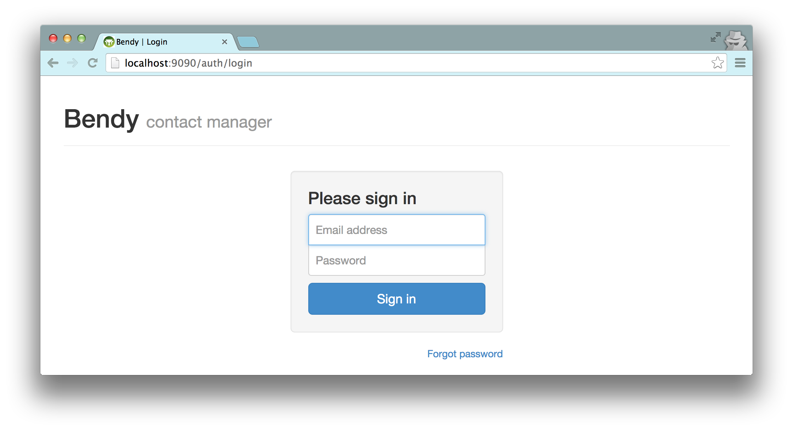

contact info sharing web app
============================
final report  
ICS 699 project  
J. David Beutel  
2014-10-28

Introduction
------------

I rarely use postal addresses, until I
send out a bunch of holiday cards.  Every year the Post Office returns a few,
because the addressee has moved during the year, so I need to
contact friends or relatives to get the updated address.  Phone numbers
and email addresses also change now and then.  For years,
I have wanted a more convenient way to share
this contact information between my friends and family.

As my capstone project, I tried to implement a web application for this,
to enable friends and family to collaborate in maintaining their
address books.  In 2009 and 2010, I did several
projects building towards this.  However, the more preparatory work I did,
the more daunting it became, until I doubted whether I could do a full
implementation in just 6 credit-hours.  Nevertheless, I finally decided
that I had to try.

The biggest challenge that I anticipated was how to manage the privacy of
third-party information, in a way that is easy to use.  Unfortunately,
I never got to that functionality, because I had to deal with more
fundamental issues first.  I started with a partial UI prototype that
I made for a project in Spring 2010 (ICS 664).  I updated its design to
address several issues, and did some user testing on the old prototype.
My primary goal was to create a modern, "rich" web app, with the best
UI possible, using HTML5/AJAX/JSON/REST/Bootstrap/AngularJS/Grails.
Learning about AngularJS, Elasticsearch, and cloud hosting took
longer than I expected.  I made big improvements to the prototype's UI
with my new architecture, and implemented some new functionality.
However, I ran out of time, and could not implement a significant
amount of what I wanted.

Nevertheless, a second user test to evaluate my UI improvements and find
more issues demonstrates that I have learned and accomplished a lot in
this project, and laid a solid foundation for continuing development of
my contact info sharing web app.

Previous Work
-------------

I have done several class projects leading up to this one:

* Spring 2009 ICS 667:  Agile Usage-Centered Design of a
Social Networking Contact Book
* Fall 2009 ICS 668:  Managing Privacy for Transitive Sharing on a
Social Networking Site (literature review)
* Spring 2010 ICS 664:  We'll Call You (partial UI prototype)

Below are samples of the interaction scheme
from my project for Spring 2009 ICS 667:  Agile Usage-Centered Design of a
Social Networking Contact Book.

Below is a design from my project for
Spring 2010 ICS 664:  We'll Call You

Below is a screen-shot from a partial UI prototype of the above project,
implemented as a Grails 1.2.2 web application in 2010.
Due to time constraints, it did not actually implement editing or adding
contact information, permissions, history, search, notifications, etc.
For example, in the below screen-shot, the Save button, Search button,
New Contact link, and Add select all did nothing.

Proposal - 2013 Spring/Summer
-----------------------------

Since my 2010 project, I considered several issues that I had
found in the design of my previous work, and ways to mitigate them,
listed below.  Finally I wrote the proposal for this new project.
I proposed to:
* start with my 2010 project's partial UI prototype;
* look for new, relevant research since my 2009 literature review;
* design for the below issues;
* update the prototype to current software frameworks;
* implement authentication via Facebook and Google;
* implement editing and adding information;
* implement additional functionality (which I was not able to complete
within this project's time-frame):  email/notifications, history,
permissions/privacy, duplicates/unify/link, and import/export/sync;
* perform user testing;
* implement revisions and retest;
* and, write this final report.

## Issues ##

### privacy & trust ###

This kind of sharing raises privacy concerns.  A phone number or home
address connects to the physical world, so most people don't want
theirs to be public.  Deciding how to share ones own contact information with
a second party is straightforward; several apps already support this,
such as Google, Facebook, and Plaxo.  (See examples below.)
However, these networks do not support the sharing of third-party
information, so their users are encouraged to get their contacts
to join the same network.  While that is good for the network,
getting its users to promote it virally,
one cannot expect to get all of ones contacts
to join and manage their own contact information.
Some will choose to join other networks instead, or refrain entirely
due to privacy concerns.

This forces one to manage other people's contact information
in ones own address book.  Why not collaborate on that?
The difficulty is that sharing a third party's contact information
with second parties involves some wicked problems.

Suppose that my grandmother does not
use the app, so I input her address myself.  I know that she would
want my brother to have her new address, and I trust him to share it
appropriately, but how far does that trust go?  If he shares it with
his wife, can she share it with her friends?  If my grandmother finally
starts using the app, and asserts her privacy preferences, do they apply
to the information that other users have input about her?  Who owns
that information?  What cognitive model and UI would support this?
Would enough contextual integrity (Nissenbaum, 2004) be provided by
showing from whom the information or update came?

### unification ###

Different users will have different relations to the same contact.
If the app lacks good support for that, then it will not sustain the
collaboration that makes it worth-while.  In other words, for each user's
own privacy expectations on behalf of each contact, the app must allow
the user to easily share that contact with the other users who he trusts
to have it.

When a user imports his address book, some of his contacts will be in
different social groups.  They are all related to him, but not all to
each other.  If one of these contacts becomes a user, she must be able
to import her address book too, which will have only some overlap with
the first user's.  The app must recognize which contacts refer to the
same identity, for these two users to be able to share their updates
with each other.  A user may manually link or confirm an identity, to
accept updates.  On the other hand, the more hops separate two users,
the less information they will want to share about a contact.

At the logical extreme, suppose that a user, Bob, who I do not know,
also inputs my grandmother's address.  We cannot share this information,
because we have no reason to trust each other.  So, the app cannot have a
single copy of my grandmother's address that we all update, like a wiki.
It needs to have two separate contacts for this same identity.

Now, suppose that Charlie, who Bob and I both know, starts using the app,
and Bob and I both share my grandmother's address with him.  Charlie
doesn't want two copies in his address book.  So, each user needs his
own copy, receiving optional update advice that ripples through related
copies.

This could allow for a distributed, peer-to-peer architecture,
possibly utilizing attribute-based encryption, as discussed by (Baden
et al., 2009), although my project implements a centralized web app.
Each update advice could come with some level of trust or certainty,
based on the relation it came from, and be applied automatically
(with history to rollback if necessary), or after manual approval,
similar to the system described by (Shand et al., 2003).
(Abdul-Rahman & Hailes, 2000) and (Jøsang, 2001) provide a background
for how that system handles subjective trust and uncertainty,
but I did not plan to try to implement such automated intelligence.

My previous work designed permissions and history for the wiki model,
but the above issue leaded me to think that this distributed model
would be better (even in a centralized web app).

### identity ###

The app will need to identify contacts and users.

##### contacts #####

Contact identity, for unification, will be based on name 
and location.  Matches can be approximate or historical.
The user can confirm via linking.

##### users #####

The basis of a user's identity is their email address:
a ticket mailed in an invitation to that address links the new user
to the contact information containing that address.
Supporting authentication via Facebook, Google, etc. would allow
for a stronger identity.

Users input their own contact information, and can share it with a higher
level of trust than third parties can.  There is no absolute trust,
however, since impersonation is easy: a user can always assign a contact
a fake email address that he controls.  The app could at least warn about
suspicious identity, such as two users with the same name and location.

## Existing Examples ##

I have not found any existing system that supports what I had wanted
to implement with this project.  However, several apps came close,
are well-implemented, and well-integrated.  My proposal included the
following overview of them, as of mid-2013.  None support collaborative
maintenance of third-party contact information, though.

### Google ###

Various Google apps are well integrated,
and support some aspects of this project.

#### Google+ ####

A user's Profile in Google+ allows sharing of the user's own home and
work contact information, with a nice UI, especially for privacy settings.
The granularity with whom to share is good, integrating with "circles"
(i.e., groups), and allowing for individuals.  However, the granularity
of what to share is limited to all home or all work contact information.
For example, one cannot share ones home phone number with one group
and home address with a different group.  Also, Google+ does not
accept third-party contact information.

#### Gmail Contacts ####

The Contact Manager in Gmail, on the other hand, does allow third-party
contacts, in "My Contacts".  The user can input anyone.  However, it
does not support sharing that third-party data.  Second-party information
shared from the user's Google+ circles is also displayed, though.
Here is a circle named "Following".

Any Google+ profile contact information that the second party shares
with the user, whether publicly, individually, or via the second party's
own circles, is displayed at the bottom.  The user can add more
information himself in the top part of the page, which adds the
contact to the "My Contacts" group, in addition to any circles.
Google does not support sharing any of that information with anyone else.
Although Google allows it to be exported, or synchronized with smart phones,
the assumption is that those are not for some other user.

#### Android HTC ####

The "People" (aka Phone-book) on a smart-phone running Android 4.0
(HTC Sense 3.6) can be integrated with Contacts on Google and other
stacks, e.g., Facebook.  These contacts, which are sync'ed with separate
sources, can be linked on the phone.  Regarding the contact information
that the user inputs on his phone, he can choose to store it on-line in
his Google Contacts (instead of just on the phone).

The phone stores links in the Notes field of the "My Contact" of
Google Contacts, e.g.,

    <HTCData><Facebook>id:575439899/friendof:1664495322</Facebook></HTCData>

#### Google Drive ####

Google Drive (nee Docs) supports sharing of third-party data,
or any data that can be put into a spreadsheet or other document.
The sharing is simple, at the top level, dividing documents
into ones the user owns, "My Drive", and ones shared with the user
by other owners, "Shared with me".

"My Drive" contains docs owned by me.

"Shared with me" contains docs owned by other users.

A document owner can choose to share it with other users.
However, this sharing is all or nothing; it cannot share only part of a doc.
So, it does not support the fine-grained sharing required by this project.

### Facebook ###

As with Google+, a Facebook user can add contact information to his profile
to share with second-parties, other Facebook users, or the public.
The choice of privacy settings are similar, with "lists" instead of "circles".

The user can customize access down to the individual,
or even excluding individuals from chosen groups.

However, Facebook does not have a way to input or share third-party
contact information, although there could be Facebook apps that provide
this kind of functionality.  Facebook at least allows this kind of
sharing of other kinds of information, such as tagging second or third
parties in photos and sharing them with other third parties.  On the
other hand, Facebook has some safeguards for this, such as notifying
second parties and allowing them to un-tag themselves or even un-friend
the poster.  Of course, over time, Facebook adjusts its privacy settings,
UI, and functionality, so this is just a snap-shot.

### Plaxo ###

Plaxo supports contact information similar to Google, but with
fewer privacy settings.  It encouraging users to share their own work
or home "cards" with second parties, and also allowing them to input,
import, or sync third parties.  But, it does not allowing them to share
third-party information.

Delay - 2013 September
----------------------

A couple weeks into the 2013 Fall semester, I was hit by a truck
and broke my thumb.  It required surgery and physical therapy.
Arranging for my medical care, recovering, and dealing with the
insurance and liability took a lot of unplanned time.
This delayed the start of my project.

Research - 2013 October
-----------------------

To get updated research since my literature review of 2009,
I found [five later publications](../newResearch) that referenced
the same references, and looked interesting.  I read them and
took [notes](../newResearch/notes.md).  Unfortunately, they
did not provide answers to the design issues of my current project,
so I excluded my summaries of them from this report.
Still, for the sake of completion, I listed them in the references:
* (Cutillo et al., 2009)
* (Mun et al., 2010)
* (Narayanan et al., 2012)
* (Shakimov et al., 2011)
* (Waters, 2011)

### GitHub ###

To provide my advisor with convenient access to
those five references, I added them to my GitHub repository
of the documents of this project, along with the proposal,
status reports, notes, and now this final report.
When viewing this report on GitHub's web site,
it has relative links that provide the easiest access
to those papers.

I do not have the right to redistribute those five papers,
so I did not want to put them in a public repo on GitHub.
(However, I believe that providing them to my advisor is
fair use.)  Initially, I searched for other Git hosting
web sites that offered free private repos.  I tried
two:  BitBucket and GitLab.  Unfortunately, they did not
work as well as GitHub, and could not handle relative links
in MarkDown files, the format that I am using to document this project.

Finally, I got a student account at GitHub,
which allowed me to have free private repos.
So, I made the documentation repo private,
added the references to it, and gave my advisor access to it:
https://github.com/jdbeutel/ics699-docs

Just a month later, GitLab informed me that it added support
for relative links, but I have not had time to go back and try
it again.  BitBucket, on the other hand, is an Atlassian product,
which has had an issue open on this for 18 months already:
https://bitbucket.org/site/master/issue/6315
It has 391 customer votes so far, but Atlassian has shown
no intention to fix it.  It seems like no competition for GitHub.

### Use ###

The best use I could make of the new research, I thought,
was as examples of what this final report might look like.
However, those papers had constraints on their length and
content that this report does not, and on the other hand,
this report needs to include more details about my work.
So, after all, I did not use those papers as a model for this report.

One use that I actually did make was of a position paper,
(Narayanan et al., 2012), that supported my decision to not
use a decentralized architecture for the app.  I was tempted by such
an architecture, because it would mirror the data model, but the paper
confirmed that it would just complicate the project for no real benefit.

I could have continued researching, but I had to go on with the project.
I doubt that I overlooked any important research.

Design - 2013 November
----------------------

I updated the design of my 2010 project to the distributed data model
that I suggested in the unification section above.

### Data Model ###

My previous design was like Wikipedia, where users collaborate
to keep the same instance of data up to date.  My new design is more like
Github, when users fork their own copy of the data and share updates.
This forking will add some new complexities, but it resolves several issues
with my previous design, and it matches better with what users do
in the real world with their own physical address books or smartphones.
Although the data model is distributed, the architecture is still
centralized, i.e., the web app runs on a single server, containing
each user's copy of the data.

#### Old, Wikipedia Model ####

My old, Wikipedia model was oriented around who can view or edit each
instance of data.  In that model, a person's current contact info
appeared only once in the system, not in different copies for different
users; the data was central, intended to approach the objective truth.
The UI included a color key on the expansion toggle buttons, to indicate
that zooming in will reveal editable fields.  It also displayed the
owner of the data, if other than the current user.  (Users could add
their own private notes and data to this central data.)

Users who were allowed to edit the contact could update its info,
adding corrections or reverting to earlier versions in its history if
necessary.  The users with permission to see the contact could watch this
collaboration of updates, and hopefully reach a consensus.  The owner
of the contact could have the final say by revoking edit permissions.

That model was complicated by managing transitive access to the data,
such as friend-of-a-friend, potentially revoking access to the user
who provided the data in the first place.  It was also complicated by:
supporting only a single instance of each person in the system, requiring
them all to be discoverable by all users; needing to provide a way for
a new user to gain ownership of her own person; and, resolving collisions
between unrelated users (as described in the issues section above).

#### New, Github Model ####

In my new, Github model, the user can edit all the data she can see,
because she gets her own copy of it.  So, there is no need to indicate
where to dig for editable fields.  Just like the real world,
if the user has access to some data, then she can choose with whom
to share that data, directly.  This model is centered on the user,
making her data subjective and relative, resolving the issues
listed above with the Wikipedia model.

When data is shared, each copy retains the ID of the original, along
with its own ID.  This forms a set across transitive copies of the data,
allowing the app to group together updates for the same original ID.
The user can share her updates with a subset, or whichever users she
chooses.  Updates offered to a shared group display which members have
accepted or rejected them, serving as recommendations and providing
hints to users about whether they should trust the advice,
based on the user's knowledge of the relation of each member
to the information being updated.  In addition to accuracy, hopefully
this will provide enough contextual integrity (Nissenbaum, 2004)
and accountability for each user to share the data responsibly.

I did not plan to have the app automatically decide
which advice to trust, despite having found some research on that
(mentioned in an earlier section about the unification issue).
This is because the app would still need to let the user override
any automatic decision, or make a manual decision when the app
did not have the confidence to make an automatic one,
so it would not simplify the UI.  Also, contact information
should change rarely enough that the lack of this automatic
feature should not be a burden.

A user could hijack a shared contact, like a hijacked email thread,
by filling in the wrong data, or data for a different contact.
In that case, my app will rely on peer pressure.  The other users
can reject such updates, or contact the transgressor out-of-band.

Besides sets of copies, there may be duplicate data,
input by multiple users, or imported from multiple sources.
Like contacts on an HTC smartphone, the app can suggest duplicates,
and the user can link them by confirming.  The app updates the
linked data with each other, so the user can choose to let
missing data be filled in, or inconsistent data be unified.
Contacts that are linked are displayed in aggregate.  Duplicate data
can provide different streams of updates from different sources,
and share updates with different groups.

### Privacy ###

The contacts in my previous model were discoverable, exposing
name and city to the public, like on Facebook, so users could
send access requests to the (hidden) owner of the single instance
of contact data.  On the other hand, the owner of the data
had full control over it, even if it came from other users,
which I expected to increase privacy, but raised issues of
fairness and expectations of the conceptual model.
In my new model, the contacts are not discoverable; each user
has her own contacts, and can choose to share them as she wishes.
The app supports offers, but not requests, to share data.
If users make requests, they will need to be out-of-band,
outside the app.

### Editing UI ###

Since the app will be used more to read than to write,
I changed the design to a more conventional mode for editing.
The data will not be in input fields until the user presses
the Edit button.  Then Edit becomes Save, a Cancel link is added,
and the collapse buttons will be disabled, preventing the user from
hiding unsaved data.  Changed input fields and the Save button
will still be highlighted in yellow.  If possible, it will warn the
user about closing a tab or navigating off a page with unsaved data.

After Cancel, a Redo button will appear.  Likewise, after Save,
an Undo button will appear.  The undo period is limited to 10 minutes,
after which other users may receive update notifications,
and email may be sent.  After that timeout, the change can
still be undone via history, although other users may have already
accepted that change.

User Testing - 2013 December
----------------------------

I did some limited user testing of my 2010 prototype,
while visiting my mother on the mainland.
I had to upgrade the prototype from Grails 1.2.2 to Grails 1.3.9,
and modify it to run in mainland timezones.  The upgrade was
required because the Grails 1.2.2 build dependency system was
three years out of date and no longer compatible with its
online support resources.

### Format ###

* 4 users, from my immediate family, 1 male, 3 female, ages 50s, 60s, & 90s.
* I worked with each individually, for about an hour,
without each seeing any others doing this.
* I described the scenario to the user that she had received an email
from me, offering to share contact information for family and friends,
with a link to the page that I showed her in the browser of my Mac.
* The page was the login page of the prototype, with a link to register.
* I asked the users to explore the app, thinking out loud,
while I took notes.

### Results ###

* Most users tried to login before registering.  The login requests
an email address as an identifier, and for the password some tried
to use their email password, even though they had not registered
yet.  To mitigate this, my new app will send an email with a link
directly to the registration page, not the login page.  The
registration page will have an "I already signed up" link to the
login page.  The login page will still have a link to "sign up",
for users who arrive by URL or search engine.
* The registration form caused several problems.
The worst was that it required a profile image,
which users were unsure about how to select,
and any validation error required the image file to be selected again,
because the original selection was forgotten.
This will not be a problem with my new app, 
because it will not require any image for registration
(allowing essentially anonymous users, as the model is oriented
around the user, not an objective method for discovering other users).
* The password confirmation also caused some difficulties,
although that illustrated its necessity.  My new app will
ameliorate that by not obscuring the password input characters,
and providing ways to register and authenticate with existing
accounts and single sign-on (such as Google or Facebook).
* One user got stuck in the registration,
and I helped her complete it, but used the wrong name.
She was then able to navigate to her profile and correct her own name.
But, then she tried to navigate with
the browser forwards and backwards buttons,
which failed to show the results of her editing and saving, confusing her.
I am not sure how to avoid this issue.
* Many users tried clicked in the middle of the contact lines
to get more details, before learning that they had to click
the [>] buttons on the left edge to expand the details.
(Some users had recently started
using Windows 8, with its flat design.)  To improve this,
my new app will expand for clicking anywhere on the line.
* The user in her 90s had very little computer experience.
For example, she was unsure how to use the Shift key to type the @ symbol
in her own email address.  I moved the test to the browser on her own
computer, but she still could not explore the app on her own.
I am not going to constrain the design of my new app for such users.

Grails Upgrade - 2014 January
-----------------------------

I started coding the new app for this project with the
code and history of my old prototype app from 2010, in a
[new code repository](https://github.com/jdbeutel/ics699-bendy).
The first thing I did was to upgrade the prototype app to Grails 2.3.
This included converting a JUnit integration test to a
Spock integration specification, and upgrading the obsolete
navigation plug-in to the current platform-core plug-in.
However, several app components, such as the old authentication plug-in,
are still using older options for backwards compatibility.

The older versions of Grails defaulted to using the Prototype
JavaScript framework, just like Rails (the inspiration for Grails).
My prototype app used the same,
but that framework could be considered obsolete now,
and I did not want to develop another project with it.
The current versions of Grails default to using the JQuery
JavaScript library, which has dominated in recent years, with a
[95% market share](http://w3techs.com/technologies/overview/javascript_library/all)
as of October, 2014, compared to Prototype's 4%.
I have several years of experience with JQuery now,
and could have easily converted the old prototype JavaScript
to implement the same UI with JQuery, but the user testing confirmed
that that old UI needed many improvements.

I wanted to make a modern, "rich" web app,
with the best possible UI, so I planned
to develop a primarily single-page, HTML5, AJAX app,
using the REST features of Grails 2.3 on the server side.
Unfortunately, JQuery by itself does not have good support
for binding AJAX/REST to the DOM.  Additional, complimentary libraries,
such as [Backbone](http://backbonejs.org/),
[Knockout](http://knockoutjs.com/index.html),
[Agility](http://agilityjs.com/), or
[AngularJS](https://angularjs.org/), provide such support.
Of those first three, I thought that Agility looked like the best to
work with, so I gained some experience with it at work.
Agility performed well as a light-weight binding framework,
but its last update was in 2012, it has not garnered any significant
mind share or market share, and it seems unsupported now.

On the other hand, lately I had heard a lot of buzz about a new
framework, AngularJS.  It was backed by Google, and promoted by
many industry articles and blog posts.  It looked more comprehensive
than Agility, but less heavy-weight than Backbone or Knockout.
I attended an Angular hackfest hosted by George Lee,
who had recently earned an ICS master's degree from UH,
and been using Angular at work.  I tried a small sample
at the hackfest, and decided to embark on learning this new
JavaScript framework and trying to use it for this project.
My first step was to go through the Angular tutorials in detail.
Since both Agility and Angular were based on JQuery,
I had hoped that it would not take me very long to learn Angular.

Authentication - 2014 February
------------------------------

I started another new app as a sandbox for testing new
authentication plug-ins, based on Spring Security 2, in
[another new code repository](https://github.com/jdbeutel/ics699-ss2).
To that sandbox I added email confirmation for registration,
and registration and authentication by Google or Facebook account.

The Grails 2.3.7 plug-ins that I chose for implementing this were:
* spring-security-core 2.0-RC2
* jquery-ui 1.10.3
* mail 1.0.1
* famfamfam 1.0.1
* spring-security-ui 1.0-RC1
* spring-security-oauth 2.0.2
* spring-security-oauth-google 0.2
* spring-security-oauth-facebook 0.1

The Google and Facebook authentication and email seems to
function well in the sandbox app, although it lacks a UI.
But, I did not migrate this to my main app,
because I planned to update the main app's UI to Angular et al.
The old and new UI had different implementations,
so migrating the new authentication to the old UI
would have been a waste of time.
Unfortunately, I ran out of time while implementing the new UI,
so I never did add the new authentication to my main app
for this project.

### Authentication Demonstration ###

The screen shots below demonstrate my authentication
with Google and Facebook in the sandbox app.
I took these while writing this final report,
eight months after I implemented the sandbox.
In that time, the APIs at Google and Facebook seem to have progressed,
so my sandbox has gotten a little out of date.  There are more recent
versions of some of the plug-ins available, so I could try updating them,
but there is no real need for that yet, because they still work
well enough to demonstrate this functionality.

I modified the Grails default index to show the user's
logged in status with Google and Facebook.  Initially
the user is not logged in at all.

When the user navigates to a protected resource (in this case,
the FooController), it redirects to the app's sign in page,
which has links to log in or register with Google or Facebook,
along with the typical option to log in or register with
an email and password for the app itself.

When the user clicks the link for Google,
having already logged in to his Google account in that browser,
Google finds that he has not given the Bendy app permission
to authenticate him via his Google account.  So, he gets the
following dialog from Google, but only the first time.
(To do this authentication, I registered an app with Google
named Bendy.  I am actually using it with my sandbox app,
but my intention, of course, is to eventually use it with my Bendy app.)

After the user approves the Bendy app's authentication of his
Google account, he is redirected to the app.  Nobody has registered
with that Google identity, so the user is offered the opportunity
to do so by creating an account in the app.  (If someone with
that Google identity  had already created an account in the app,
then he would be logged in at this point, skipping to the next
screen shot.)

Once the user has created an account in the app using his
Google identity, he is logged in to it, and proceeds with
using the app, accessing his resources.  The sandbox app has 
no resources, actually, so for this demo, I navigated back to
the index, which confirms that the user is logged in with google.

On the other hand, back at the sign in page, if the user had
followed the link to Facebook, having already logged in to
his Facebook account in that browser, Facebook finds that he
has not given the Bendy app permission to authenticate him via
his Facebook account.  So, he gets the following dialog from Facebook,
but only the first time.  (To do this authentication, I registered
an app with Facebook namde Bendy, just like with Google, but
separate apps.)

Just like with Google, after the user approves the Bendy app's
authentication of his Facebook account, he is redirected to the app.
Nobody has registered with that Facebook identity, so the user is
offered the opportunity to do so.

Finally, just like with Google, we can see that the app
recognizes the user as having authenticated with Facebook.

### External Config ###

I made both new Github repos private, like the ics699-docs repo,
to avoid worrying about leaking sensitive information during
project development.  However, I also externalized the
sensitive information, such as passwords and secret keys for
sending email and authenticating with Google and Facebook.
I did that using a configuration like the following,
to avoid committing the sensitive stuff to the repo,
so I can eventually make the code repos public again.
I include the example here, because it is not in the repo.

    // in Config.groovy, configuring the external config file
    grails.config.locations = ["file:${userHome}/grails-conf/${appName}-config.groovy"]

    // in the external config file, with secrets masked for this report
    grails {
      mail {
        host = "smtp.example.com"
        username = "johndoe"
        password = "xxxxxxxx"
      }
    }
    
    oauth {
      providers {
        google {
          key = '999999999999-xxxxxxxxxxxxxxxxxxxxxxxxxxxxxxxx.apps.googleusercontent.com'
          secret = 'XXX-xxxxxxxxxxxxxxxxxxxx'
        }
        facebook {
          key = '9999999999999999'
          secret = 'xxxxxxxxxxxxxxxxxxxxxxxxxx'
      }
    }

Conversion to AngularJS - 2014 March
------------------------------------

I spent a lot of time in March learning AngularJS
and starting to convert the main app to it.
The learning curve was steeper than I anticipated,
but I still thought it would be worth it, so I stuck with it.

### Bootstrap Style ###

The prototype used the old Grails default CSS styles and classes,
because I was not very concerned with how it looked at that point.
However, on the new app, I added the 
[twitter-bootstrap plug-in](http://grails.org/plugin/twitter-bootstrap)
version 3.0.3, along with
[AngularUI Bootstrap](http://angular-ui.github.io/bootstrap/)
version 0.10.0,
in order to use a number of rich UI controls that work with Angular:
* Alert
* Buttons
* Collapse
* Datepicker
* Dropdown
* Progressbar

Throughout this project, I also used Bootstrap 3's
default CSS styles, in particular for:
* responsive design grid layout,
* navigation bar, with change to a (non-Angular) drop-down,
* tables, 
* forms,
* alerts,
* panels,
* buttons,
* and glyphicons.

I plan to adjust the style later, to make it look better,
but I think that even the Bootstrap defaults are a big improvement
over the default Grails style.  I designed the app primarily
for the desktop, because the extra screen real estate is useful
for the simultaneous viewing and comparing of contacts,
but I think that Bootstrap's support of responsive design
improves the app's usability on mobile devices too.

Below is an example of the grid layout design responding
to the width of the browser, changing the navigation bar
into a menu button, and the way that navigation menu looks when
dropped down.

### Replacing Prototype ###

I completed the Angular tutorial, and converted my project's old
JavaScript (based on the Prototype library) to Angular, starting
with the Settings page.  However, this update of the existing
JavaScript was superficial, because it had only the following
functionality:
* a button to expand and collapse the change password section
* highlighting modified input fields
* enabling and highlighting the save button for modifications

It still reloaded the whole page to display input validation error
messages, like a traditional web app, not the way that an Angular
web app is supposed to work.

### AJAX, JSON, & REST ###

Next I started converting the Settings page to the Angular style, using AJAX,
and on the server side, converted its Grails controller to REST and
JSON.  The server sends the static page, and the Angular controller
gets the data to fill in and initially display.  The save button
posts another AJAX request, without reloading the page.  A successful
response resets the modification highlighting and updates the model's
version numbers for optimistic locking, while an error response
just displays the error messages from the server.

I handled an optimistic locking failure as a special case,
displaying the newer data from the server and an error message
from the client, similar to the pre-AJAX UI.  However, at that point,
I started to consider eliminating this optimistic locking on the user
level, allowing the last post to win, because users will be editing only
their own copies of the data.

### Angular Form Validation ###

I also learned about the native Angular support for form modification
and validation, using that instead of my initial conversion.  However,
I found that the modification support was not quite what I need, because
after an input field is modified once, Angular still considers it to be
modified after it is changed back to its original value.  Modifications in
my project are more significant, because they generate notifications,
so I don't want any false indicators.  I implemented another Angular
directive to handle modifications properly within the native Angular
form support.  It was harder to do, because it was tightly integrated
with the Angular framework.

For form validation, I had planned to use the new support in HTML5.
[User testing shows](http://alistapart.com/article/inline-validation-in-web-forms)
that this kind of immediate feedback is a better UI than the
traditional page reload.  The server still needs to do all the same
validation, to prevent hacking at least, but it need not render
nice, user-friendly error messages, since the browser will have
already done that and prevented the form submit.  Unfortunately,
I found some problems with HTML5 forms:
* browsers do not treat an AJAX request the same as a form submit
* Safari (including iPad/iPhone) provides no UI for this validation
* some of my validation, such as the matching password confirmation,
cannot be done with HTML5 form validation.

So, I looked for a good way to do this
[form validation UI](http://www.html5rocks.com/en/tutorials/forms/constraintvalidation/)
with Angular.  One possibility was
[this extension of Angular](https://github.com/nelsonomuto/angular-ui-form-validation).
Another possibility was
[the form support in Webshim](http://afarkas.github.io/webshim/demos/index.html#Forms),
which is based on the
[HTML5 constraint validation API](http://www.whatwg.org/specs/web-apps/current-work/#constraints).

Settings Tab - 2014 April
-------------------------

I finished converting the Settings page to
[Angular](https://angularjs.org/)
and implementing the following UI improvements.

### Interactive Form Validation ###

To render immediate, friendly feedback on user input,
[the interactive form validation from Webshim](http://afarkas.github.io/webshim/demos/index.html#Forms)
seemed to be the best option with Angular.
I used it to implement this validation, and believe that it provides
a crucial improvement in usability, going beyond Angular,
when compared with the old prototype.  The code is based on the
[HTML5 constraint validation API](http://www.whatwg.org/specs/web-apps/current-work/#constraints),
so follows the standards as much as practical.

See the example screen shots below.  The important distinction
with this interactive validation is that it occurs as soon as the
focus leaves the input control, or after five seconds.

### No Optimistic Locking ###

I eliminated optimistic locking on the user level,
allowing the last post to win,
because users will be editing only their own copies of the data.
This eliminates an error from the server that the users would
not understand or expect, but was likely to happen if a user is accessing
the web app from multiple browsers or browser-tabs simultaneously.

[Grails'](https://grails.org/) [Hibernate](http://hibernate.org/orm/)
still uses optimistic locking within a request to prevent race conditions,
but it does not extend through the long cycle to the browser.
So, it is unlikely to generate an error,
unless the same user submits multiple simultaneous changes.

### Single-Page App ###

I converted all the tabbed pages to Angular templates within a
single-page application, using Angular's basic routing module
to change tabs.  Each tab and its contents are loaded via AJAX.

For a complex tab like the Contacts, where the user may have dug
down to particular entries, or been editing them, I handled that
as state within the tab, not reflected in the route or URL.  Angular's
basic routing can do only a single level like this, and even its
multi-level routing alternatives seemed to provide no way to specify
multiple entries, so the user cannot bookmark specific contacts.
This is a trade-off for viewing multiple contacts on the same
page.

The single-page app design avoids refreshing the whole page
when navigating between tabs, providing a smoother transition.
This could have prevented form changes from being discarded by
navigating to a different tab, but I reload the tab contents via AJAX.
(To avoid loosing changes on a tab, I am thinking of adding a
confirmation dialog when navigating away from a tab with changes,
since I changed the editing to modal.)

### Modal Editing ###

I added Edit and Cancel buttons.  They show the user what she can do,
and make it easier to view her information without accidentally updating it.
Updates should only be purposeful, because they may generate notices
to other users.  Modified input fields still enable the Save button,
and highlight both in yellow, to make updates explicit.  Manually reverting
an input field to its original value still undoes the highlight, and disables
the Save button if no other input fields have changes, but the user
can accomplish that more easily now by just clicking the Cancel button.

Initially I made the input fields disabled when not in editing mode, to
show that they could be edited by clicking the Edit button.  However, in
brief user testing with Professor Robertson in May, this proved confusing.
Since all input fields start disabled, with no enabled fields for
comparison, they all looked editable, with the input box affordance,
and just a darker shade of background that does not objectively or
independently suggest that they are disabled.  The Edit button at
the bottom was easily overlooked, leading to frustration.  So, at his
suggestion, the fields are now displayed as plain text, with no editing
affordance, while clicking the Edit button unambiguously reveals what
can be edited.

### Independent Password Editing ###

In my original prototype, the Settings page used modal JavaScript
to expand password update fields that were submitted with the rest
of the form fields.  They were modal from the beginning, because 
they are one-way input fields, authenticating the current password instead
of displaying it.  Without a mode, those fields would seem to force the
user to change the password when changing any other field.
I didn't want to put the password change on a tab of its own,
because that would increase the navigation complexity.

Since the Settings tab uses modal editing and AJAX now,
nesting the modal password update within the editing
of the rest of the fields would cause problems.  The Change Password button
would be confusing if disabled, or worse, hidden, while not in edit mode.
So, I moved it below the Edit button, and gave it its own Save button,
to make it more direct and clear.  It is like a dialog now, within the tab,
but non-blocking, so both sets of fields can be updated independently.
The Change Password button still toggles to 
Cancel Password Change, instead of adding a typical Cancel button.
This can be seen in examples above.

Hosting - 2014 May & June
-------------------------

These UI improvements were taking a long time,
and I was falling behind schedule,
but I felt that they were crucial to the project.
To illustrate their significance, I tried to host my original prototype
and current project in the cloud, for comparison and constant availability.

### Original Prototype ###

I got [my original prototype running on Heroku](http://rocky-meadow-9347.herokuapp.com/).
Although I updated some of the software, the UI is as it originally was,
for user testing.  It is on a free instance, and accessible by anyone,
at any time, as long as Heroku allows it.
On first access, a user will probably get an Application Error,
as it times out waiting for Heroku to spin up a server instance.
Just reloading the page should work around that error,
and a user can normally log in to the app with the following:

* login: joe.cool@example.com
* password: password

If that password does not work, someone may have changed it
since the last time that the app was restarted.
In that case, or in any case, a user can click the
"Sign up for new account" link.  This is an easy way to review the old UI.

### Current Project ###

I also got my main app running on Heroku.  Unfortunately, as I
added new features, it kept breaking on Heroku in a way that was difficult
to reproduce on my development machine, and I could find no effective way
to troubleshoot the problems on Heroku.  Besides its
incompatibility and limited support for the Java ecosystem,
I think that I had also reached the limits of what I
could do in the amount of memory that Heroku provides for free.

I spent some time searching for better, free hosting alternatives.
I looked at various providers, of various types,
but I could not find any free ones that would provide enough
resources to run an app as large as my main one had become.

Next, I tried Jelastic, which was not free, but promised to not
charge for resources for the time when the app was not being used.
It worked a lot better than Heroku, and was simpler and easier to
deploy a Java web app (which Grails produces).  Unfortunately, I
discovered that all the Jelastic providers actually charge for a
minimum set of resources constantly, despite the app not being used.
Jelastic has the capability of automatically hibernating an environment
that has not been used for some period of time, but the providers
have a policy of only allowing that for free trial accounts,
which are available for too limited a time.

Finally, I gave up on hosting the current version during development.
These attempts and searching for a suitable host had taken a lot of time.
I decided that constant availability was not worth the cost or time to
continue searching for a cost-effective cloud host.
I would just run my project on my development machine for user testing
and demos, and look into hosting again later, when it is feature complete.

Search - 2014 July & August
---------------------------

Search is a new feature that I implemented on the Contacts tab,
beyond just converting the original prototype to Angular.
I did so because it impacted the Angular implementation,
particularly paging and sorting,
and because it is a central feature of the application.

I thought it would be easy, because I had lots of experience
implementing search in Grails with GORM from a database.
However, I used a search plug-in instead of GORM,
because I wanted a full-text search with result highlighting.
That turned out to be fundamentally different from a relational database,
and I discovered that I needed to learn a lot about it.

### Searchable Plug-in ###

Originally I used Grails' ["searchable"
plug-in](http://grails.org/plugin/searchable), based on
[Lucene](http://lucene.apache.org/) and
[Compass](http://www.compass-project.org/), because it had the best
rating, with the most Grails users and documentation, and it seemed
to be up to date.  Unfortunately, I could not get it to work as I
expected, to search within related objects, such as a Person's
Places.  Lucene builds its own index and searches on documents,
like [other NoSQL databases](http://en.wikipedia.org/wiki/NoSQL#Document_store)
that have become popular lately.
Each Person document added to the Lucene index needed to be composed
of all the related objects to be searched.

While trying to debug this, I had difficulty seeing what had gone
into the Lucene index, and why.  I tried installing
[Luke](https://code.google.com/p/luke/), a Lucene index browser,
but still could not understand what was going on.  I also found
that development on Compass had halted, with [the
author starting Elasticsearch
instead](http://thedudeabides.com/articles/the_future_of_compass/),
over four years ago.
Compass and Elasticsearch are key, because they map the Hibernate/GORM
entities to Lucene documents.

### Elasticsearch ###

So, I went with [an Elasticsearch
plug-in](http://grails.org/plugin/elasticsearch) instead.  It provides
a nice facade on Lucene, including an API with a REST interface for
browsing and querying the index in JSON.  Elasticsearch has better
[documentation](http://www.elasticsearch.org/guide/) and tools than
Compass and the Searchable plug-in (although the documentation for
the Elasticsearch plug-in is not as good).  I read [Elasticsearch: The
Definitive
Guide](http://www.elasticsearch.org/guide/en/elasticsearch/guide/current/index.html)
and
[reference](http://www.elasticsearch.org/guide/en/elasticsearch/reference/current/index.html),
and explored the index with
[Sense](http://www.elasticsearch.org/guide/en/marvel/current/#_sense),
a developer console web app that provides good support for that API.

With this new understanding, I finally resolved the issue with
the related objects missing from the search index.
The problem involved the Hibernate session and transaction
in the bootstrap initialization of my test fixture data;
I just needed to flush the session before indexing the data in Elasticsearch,
which was using a separate session, so it saw the object relations
in the database and included them in the Lucene documents that it built.
This was difficult to debug, because Elasticsearch saw the entities
in the database, but just didn't see their relations, and the relations
were flushed to the database after the bootstrap method finished running,
so the problem was not visible afterwards.
This resolution might solve the same issue on Compass and the
searchable plug-in, but I just stayed on Elasticsearch.

I also configured Elasticsearch to not analyze any of the searchable fields,
so it would provide only exact matches.  It can use various analyzers,
based on natural language, to find similar or root words in English text.
Contact information is not like English text, but I may try to use
an analyzer in the future to allow matches on typos in names and numbers.

Elasticsearch should be able to highlight the matches within search
results, but I have not gotten that working yet.  I would like to
automatically expand the matches and highlight them in the browser.
Since the app will be searching only the user's own copies of contacts,
there will probably be a limited amount, which raises the possibility
of doing the search entirely within the browser.  All of the user's
contacts would need to be sent to the browser for any search, and the
implementation would be different from the current one using Elasticsearch
on the server.  However, initially I would probably try to expand matches
in the browser while continuing to do the search on the server.

Although I had experience with database searches, this search
was more like what I did in an artificial intelligence course.
These search frameworks were new for me, and took up a lot of time.

Contacts Tab - 2014 May..October
--------------------------------

I converted the app's main tab, Contacts, to Angular and AJAX.  At the
same time, I also added new features, including editing, sorting, and
paging, in addition to searching, because they had a large impact on
the implementation in Angular.  I worked on this tab across six months,
but during this period I was also working on hosting for two months
and search for two months.

### Sorting and Paging ###

The preferred email, phone, and address that are displayed on the
top-level contacts list were virtual properties on a Person, to be elected
from a Person's available properties or sub-properties, according to the
user's preferences.  But, to implement sorting and paging on those
properties via the database (i.e.,
[GORM criteria](http://grails.org/doc/latest/guide/GORM.html#criteria)),
I needed a copy of the preferred property
on the top-level Person, de-normalizing the database.
This implementation was enabled by the new design of the app,
because each user will have their own copy of a shared Person.

I added explicit buttons for sorting, showing the selected column
and direction of the sort, instead of using the column headers as
implicit buttons.

For paging, the prototype's default Grails buttons provided a navigation
link to a nearby page of the sorted search results.  With Angular and
AJAX, however, there is no need for the browser to throw out the contents
of the current page.  The initial, limited page size (10 entries) allows
the browser to display the results faster, and hopefully it contains what
the user is looking for.  She can add a search term to quickly narrow
down the results.  If there are more matching contacts, their count
is displayed at the bottom of the page, along with a button to Load or
Load More.  If 150 or fewer entries remain, the Load button gets them all,
but over that amount, the Load More button will get the next 100.

Initially, I implemented all the sorting and paging relatively quickly,
with GORM, because I already had experience with it.
However, when I implemented search, I had to redo the sorting and paging
using the Elasticsearch API, to make them work within the search parameters.
This took more time.

### Drilling Down And Editing ###

Clicking anywhere on the row of a contact expands it to display its
details.  Several users tried to do that on the prototype, overlooking
the row's expand/collapse button.  Multiple contacts can be open
at the same time.  Each has name details that can be further expanded.
Each may have zero or more connections to work or home contact
information, such as phone or address.  These display their own
preferred properties on a collapsed line, which can be expanded too.
Each expanded part can be edited and saved independently.  The new design
does not need to indicate which data can be edited, because it all can,
since everything that the user can see will be her own personal copy.

Before finishing the conversion of my original prototype to Angular,
I started adding the editing of contacts, because it had such
a large impact on the Angular implementation.
The original had editing of the user's profile and registration,
which is like a single contact, but flat and static.
It had not implemented editing at any depth, nor in parallel,
but in this project I implemented both, with Angular/AJAX/REST.

User testing revealed problems in the original with uploading a
photo via a traditional form submit.  When any fields had an error
requiring correction, the photo file also needed to be browsed and selected
again.  That was inconsistent with other fields, which maintained
their changed but un-posted values, and it surprised and confused
users, leading to more errors.  Compounding the problem was that
the photo was required, because the prototype's data-centric design
needed it to let users identify and request access to the single instance
of that Person in the app.  To avoid these issues in my new app,
an optional Upload Photo or Upload New Photo button sends the file
independently, immediately, via AJAX.

For birth date, the original prototype used the Grails default
of three select controls: month, day, and year.
I changed that to a single control, the Angular-UI-Bootstrap date-picker,
a text input field with a button to pop-up a calendar.

The nested editing levels had a bug involving my custom Angular
directive to highlight modified fields, despite working properly
on the Settings tab.  When modifications were undone manually
in the contacts, it failed to undo the highlight and disable the
Save button.  Eventually I fixed the bug.  For that matter, there
were many bugs, but I tried to hold off committing until I could fix them,
when I found the bugs in time.

Below is an example of drilling down into a contact, but not editing it,
after a search for "cool" limits the results to just three contacts.

### Adding or Deleting Fields ###

When a contact is in editing mode, an Add drop-down button appears,
with which the user can select a new field to add.
That button is right above the Save button, but the fields above it
are displayed in a predetermined order, by type of field,
so the new, empty field can appear several fields above the
Add button.

To delete a field, in editing mode, the user can press the backspace
or delete key to erase the contents of the field.  Of course, besides
deleting character by character, browsers have shortcuts to quickly
select all the text in the input control, such as double-clicking with the
mouse, or using the tab key, or Ctrl/Cmd-A, and then the backspace key.
Then, clicking the Save button will remove the empty field from the
server's database, and stop displaying it when that part of the contact
is refreshed from the AJAX response.

However, I did not have time to implement a UI for deleting
entities such as connections, addresses, or contacts.
Deleting all their fields individually seems unwieldy,
so I think it will require a button on each one to delete.
Given delete buttons on some of the UI, it may be better
to have consistent delete buttons on all of the fields, too.

Below is an example of using the Add drop-down to add
a phone field, and another example of having added a
phone field to a work connection on a different contact,
but not having saved it yet.

### Adding a Contact ###

Since I had run out of time on this project,
the only Add Contact button that I could implement was minimal.
Clicking it adds a blank contact row at the
top of the list.  Then, the user needs to expand it and its
name details (which is ambiguous, because it is empty),
click Edit on the name details, input a first and last name,
and click Save on the name details, before trying to save fields
outside of the name.  This minimal implementation was easy to
do with Angular, but the second round of user testing confirmed
problems with this UI and suggested improvements.

Registration and Profile - 2014 October
---------------------------------------

To prepare for the second round of user testing,
and provide more consistency with the first round,
I added the following, relatively easy parts of the UI.

Having run out of time to integrate the Spring Security 2 sandbox app
with Google and Facebook authentication, I proceeded with implementing
these on the old authentication plug-in.

### My Profile ###

The My Profile tab contains just the user's Person.  Each user has one
Person that the user represents.  The UI is just one permanently expanded
contact from the Contacts tab, without the list of other contacts.
This was easy because I had already implemented it for the Contacts tab.
The user can view and edit her Person in her My Profile tab the same
as in her Contacts tab.  That Person gets her own tab because she is
important to the user, but also appears on the Contacts tab to allow
for reference and comparison with other contacts.

### Invitation ###

I added an Invitation domain object to link a Person
to a new user's email address.  I didn't implement any UI for
this yet, but the scenario for the second user tests is:
* a current user inputs a person's contact info (at least name and email);
* the current user asks the app to send an invitation to that person;
* the app generates an email with the invitation and sends it to that
person's address;
* that person receives the email and clicks on the link in it
to start to register and proceed with user testing.

The app does not actually do the above yet,
but I added invitations to the test fixtures
for the participants in the user tests.
The real invitations will select random numbers to use as IDs,
to provide some security.  For the user testing, I wrote the
invitation emails by hand, with a link to the invitation in
the test fixture.  I showed the test subject the email on my
own laptop, in my own email client, and explained that they
should imagine that my email had arrived in their own in-box,
and then click the link in it.

The invitation effectively verifies that the new user has access to
the email to which it was sent.  Different users are not allowed to
have the same email address, so if an address has already accepted
an invitation, then the user must login with the already-registered
password instead.

### Registration ###

The link in the invitation email goes straight to the registration
page, which I updated to require only that the user choose a
password.  After the user provides and confirms her new
password, the page redirects to her My Profile tab, where
she can optionally fill in the rest of her details.

I intended this UI enhancement to avoid several problems
found in the first round of user testing:
* trying to login without registering first (impossible now that the link goes straight to the registration page),
* needing to upload a profile image (optional now, and possible only after registration is completed),
* confirming the chosen password (easier with the passwords displayed, the interactive validation, and nothing but the passwords on the form).

Compare the new registration page, below, to the old one of the
prototype, after.  Several fields on the old one are invalid, but
the user gets no warning until the form is submitted to the server.

### Sign In/Out ###

I restyled the Sign In and Sign Out pages in Bootstrap,
with the interactive validation requiring an email address
and password.

Second User Testing - 2014 October
----------------------------------

I did some limited user testing to confirm or evaluate the improvements
in the new app over the old prototype, and to find or confirm further
need for improvement.  The format was the same as in the first user
testing, starting with the scenario specified in the Invitation
section above, and then several tasks I suggested, such as,
"Please try adding your phone number," or, "Please change Alex's
work address."

I tested four users, all middle-aged:
* One, my wife, was the only one also in the first round of user testing.
* Her friend is also female with an A.S. degree in interface design.
* My co-worker is male, with an M.S. degree in computer science.
* My project advisor is an expert in user interfaces.

### Improvements ###

The improvements that I made to mitigate the issues that were found
in the first round of user testing seemed to be generally successful.
Nobody had any significant difficulty with the registration step.

* Nobody tried to login before registering.  Only one user said,
"What's the password?" but quickly noticed that it was a request
to choose one.
* One user tried to choose a 4-character password, but was
quickly corrected by the interactive validation.
She expressed some annoyance that the 6-character requirement was
not displayed in the first place, but quickly got past it.
Beforehand, she commented that choosing a password is a pain.
* One user was nervous that while choosing and confirming
the password, its characters were not hidden.  It made him question
how secure the app was.  He suggested defaulting those inputs to
hidden, with an un-hide check-box.
* Everyone quickly learned the basic modal editing,
and were able to change or add fields to their profile.

### Observations ###

* Two users selected a month and day with the mouse on the date-picker
calendar, and then changed the year via the input text field and keyboard,
in a fast and fluent manner.
* Users were able to quickly search, and learned to edit without
too much difficulty.
* "It takes a while to learn where to go, but once I do it a few
times, I can see where to go."

### Issues ###

* All users had major problems identifying which Edit or Add button
to use for certain fields.  It was not always the closest button,
and not always visible.  "I thought Add was for another contact."
"Why is name and the rest separate?"  "I don't know how to add my
phone number."
* Users had problems adding a contact, editing and saving the
name first.  Some suggested that a newly added, blank contact
start out expanded with the name in editing mode.
* Some users saw the connection rows as starting a new contact,
because they look too similar, and are not indented enough.
* For a contact with lots of info, fully expanded, it can't all fit on
a single page.
* Some users wondered what information would be visible to other users.
* One user wondered, "If I add a contact, do I invite that person?"
* One overlooked the success message from a password change,
because it was displayed at the top of the page, but the password
change section was at the bottom.
* Everyone was confused by the name, "Bendy".  "Is that the name?"
"I don't know what that is."
* Users felt that the email was "sketchy".  One commented that it
looks like phishing spam, and she would never click the link,
because it is dangerous.  Several suggested that the email needed
more details and explanation.
* After registering, while looking at the My Profile tab, 
one user commented, "I don't know what site this is."
She didn't really read the email.
* One user clicked the browser's back button, and one considered doing so.  The app does not support this, and when to the registration page, with an exception.
* One user wanted a way to clear all fields in an address somehow.

Future Work
-----------

I would like to do a lot more work on this app,
beyond the end of this project.

First, I would look for solutions to the issues found in
the second round of user testing.  It will require
more changes to the design of the UI.  Here are some changes
that I am considering:

* Have one Edit button for the whole contact, including every level.
* Put an Add button in each property type section, instead of a drop-down button above Edit.  This will take more vertical space, especially for empty property types, but only while editing (now that we have editing mode), and this way will have a better chance of remaining within the locus of attention.  (Perhaps adjacent empty sections could be coalesced?)
* Change styles to less space between lines when not in editing mode, so more of a contact's details can fit on a single page.
* Put a delete button by every field and entity in the contacts.
* Indent the connections more, and emphasize the nesting style.
* Add a hover highlight to improve the delineation and gestalt of the contact
(like in the old prototype).
* Start a newly added, blank contact in editing mode
with the name expanded.
* Compose an informative email template for invitations.

I would also like to integrate the profile with authentication.
Currently the user
can freely change her login email address in the Settings tab,
with no verification.  That address can be duplicated on the
My Profile and Contacts tabs.  I would like to display it
on only those tabs, but read-only, if registered for login.
An already-registered user could receive another invitation at
a second email address.  She should be able to add that
address as another verified way to login to her existing account,
using her existing password, instead of adding a secondary user.
If she wants to login with another email address, she should
be able to send herself an invitation to verify that address.
Likewise, after I integrate the Spring Security sandbox with
Google and Facebook logins, the user should be able to add
those authentication methods to her account, or use them instead
of configuring a password.

Finally, there are small parts of the current UI that are
missing or not working properly, and large areas of functionality
that have not been implemented yet.  For example:

* Birth Date
  * display in preferred format
  * separate date from time preference settings
  * bug: after first use, calendar fails to reappear
  * bug: after reverting change in text input, field and Save button remain highlighted
* photo upload
  * progress bar and Cancel Upload button are not displayed
  * drag-and-drop border does not hug the image or animate to suggest drop-ability
  * making the Edit/Cancel button revert to original photo after uploading a new one
* displaying more types of properties
* deleting addresses, connections, or contacts
* highlighting and automatically expanding matching search results
* email/notifications
* history
* permissions/privacy
* duplicates/unify/link
* import/export/sync

References
----------

Abdul-Rahman, A., & Hailes, S. (2000).
Supporting Trust in Virtual Communities.
In Hawaii International Conference on System Sciences 33, pp.1769-1777, 2000.

Baden, R., Bender, A., Spring, N., Bhattacharjee, B., & Starin, D. (2009).
Persona: an online social network with user-defined privacy.
SIGCOMM Comput. Commun. Rev., 39(4), 135-146. doi: 10.1145/1594977.1592585.

Cutillo, L. A., Molva, R., & Strufe, T. (2009).
Safebook: A privacy-preserving online social network
leveraging on real-life trust.
IEEE Communications Magazine, 47(12), 94–101. doi:10.1109/MCOM.2009.5350374

Jøsang, A. (2001).
A logic for uncertain probabilities.
International Journal of Uncertainty, Fuzziness
and Knowledge - Based Systems, 9(3):279-311, June 2001.

Mun, M., Hao, S., Mishra, N., Shilton, K., Burke, J., Estrin, D., … Govindan, R. (2010).
Personal data vaults: a locus of control for personal data streams.
In Proceedings of the 6th International Conference (pp. 17:1–17:12).
New York, NY, USA: ACM. doi:10.1145/1921168.1921191

Narayanan, A., Toubiana, V., Barocas, S., Nissenbaum, H., & Boneh, D. (2012).
A Critical Look at Decentralized Personal Data Architectures
(arXiv e-print No. 1202.4503).
Retrieved from http://arxiv.org/abs/1202.4503

Nissenbaum, H. (2004).
Privacy as Contextual Integrity.
Washington Law Review 79 (2004), 101- 39.

Shakimov, A., Lim, H., Caceres, R., Cox, L. P., Li, K., Liu, D., & Varshavsky, A. (2011).
Vis-a-Vis: Privacy-preserving online social networking
via Virtual Individual Servers.
In 2011 Third International Conference on Communication Systems
and Networks (COMSNETS) (pp. 1–10). doi:10.1109/COMSNETS.2011.5716497

Shand, B., Dimmock, N., & Bacon, J. (2003).
Trust for Ubiquitous, Transparent Collaboration.
First IEEE International Conference on Pervasive Computing and Communications.

Waters, B. (2011).
Ciphertext-Policy Attribute-Based Encryption:
An Expressive, Efficient, and Provably Secure Realization.
In D. Catalano, N. Fazio, R. Gennaro, & A. Nicolosi (Eds.),
Public Key Cryptography – PKC 2011 (pp. 53–70).
Springer Berlin Heidelberg.
Retrieved from http://link.springer.com/chapter/10.1007/978-3-642-19379-8_4
